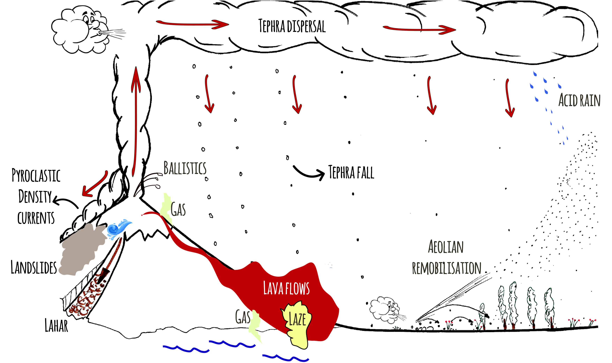
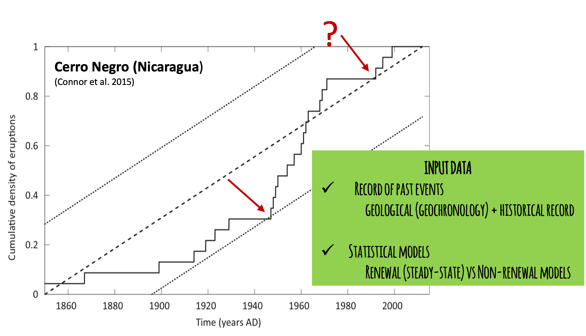
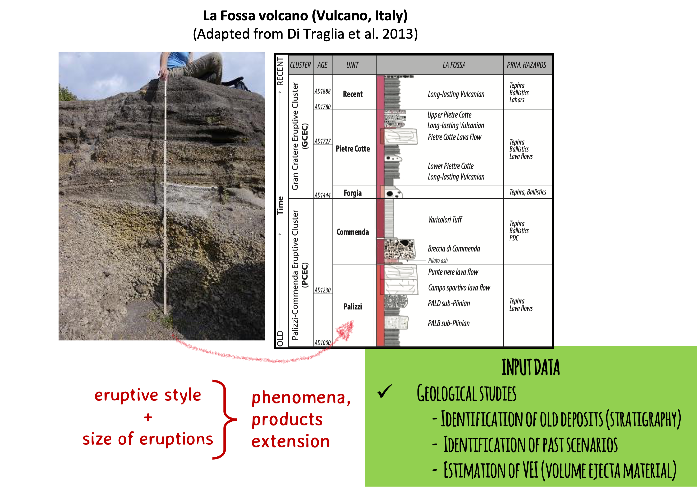
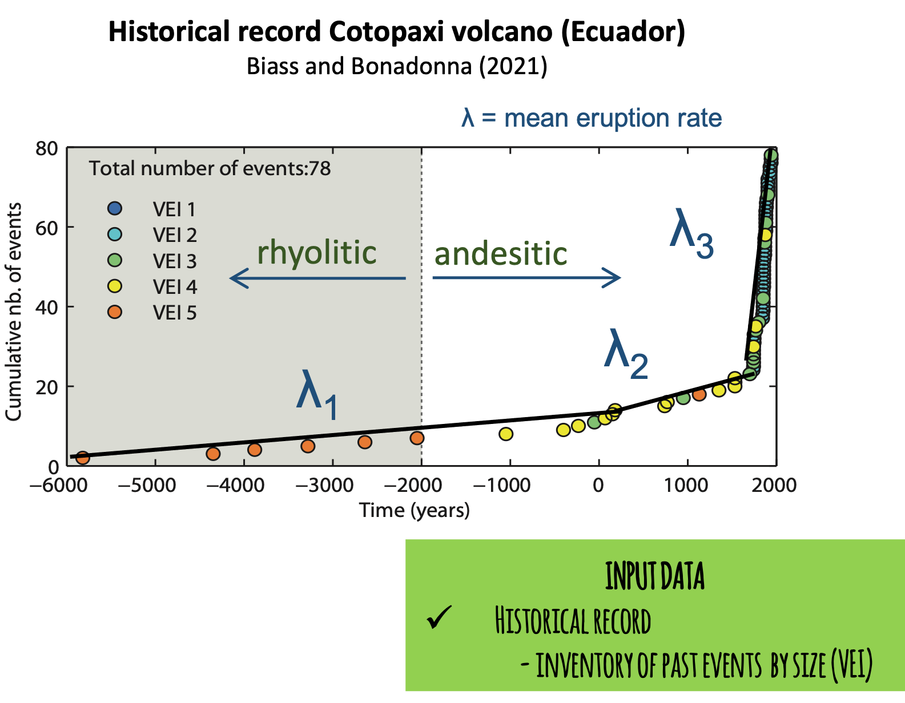
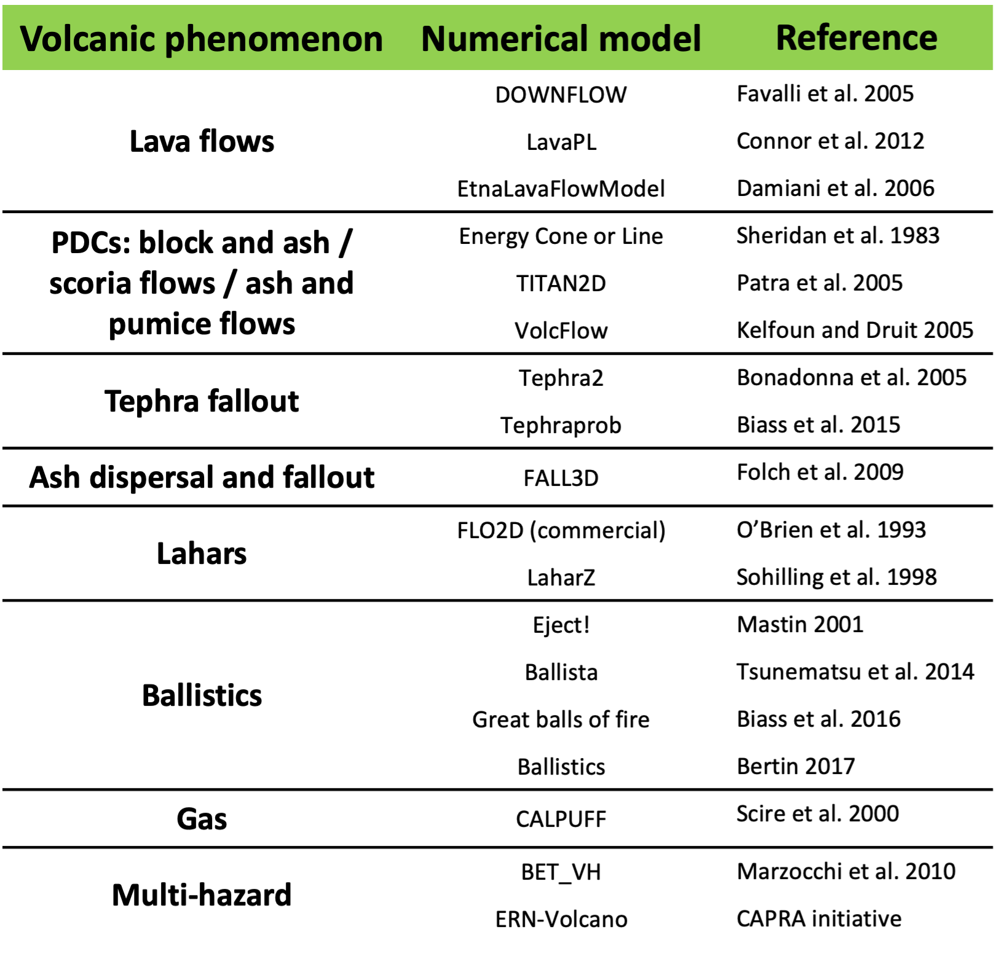
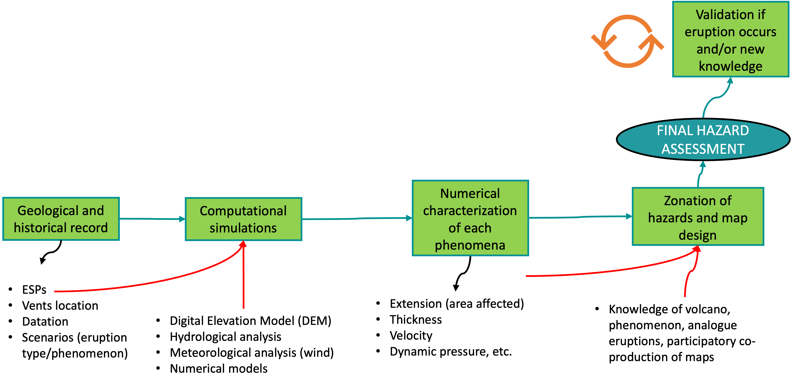
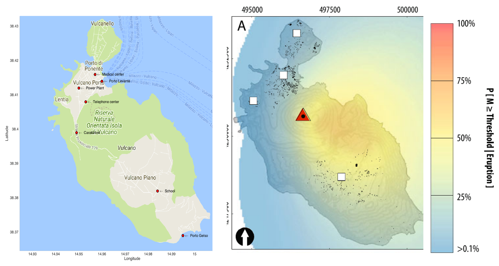
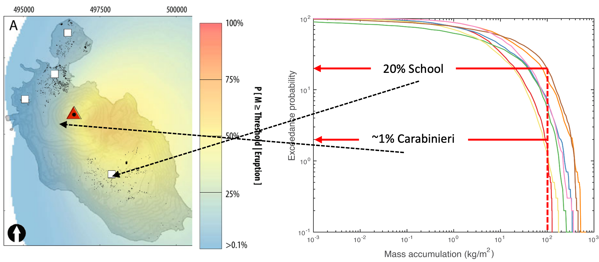

# Introduction to volcanic hazard assessment

## :material-format-list-checks:{ .icn } Objectives

- Recognize the main steps of **hazard assessments** (HA).
- Understand the main HA approaches **(short vs long term)**.
- Identify main HA **outputs**.
  
## :fontawesome-solid-gears:{ .icn } Hazard assessments

A hazard assessment is defined as an evaluation of the probability of **occurrence** of a given volcanic event of a specific **size**, associated with one or various **phenomena** affecting a given **location** during a specific time interval (Modified from Connor et al. (2015)[@Connor2015]).

<figure markdown>

<figcaption></figcaption>
</figure>

It comes to answer the main questions of **when, where, how big and what areas** will be affected in case of a volcanic eruption. 

Volcanic eruptions are particularly complex since they can involve various phenomena with different products at different time and space scales. 

!!! question "What kind of volcanic hazards are you familiar with?"

    Do you think that all volcanic products have the same space extension (runout) and temporal occurrence? Give some examples

??? note "Proximal and distal hazards"

    In general proximal [volcanic hazards](https://blogs.agu.org/magmacumlaude/files/2011/04/gip64-copy.jpg) are associated with pyroclastic density currents, ballistic projectiles, lava domes and gases whilst distal volcanic hazards are associated with tephra fallout and acid rain. Secondary hazards such as lahars and aeolian remobilisation can occur any place where volcanic deposits and certain meterological conditions met. 
    
    Some of these hazards can occurr **synchronously**, prior to the eruption (e.g., gases, earthquakes), during the eruption (e.g., pyroclastic density currents, tephra fallout) or after the eruption -even decades- (e.g., remobilisation).

    :point_up: **This is why volcanic eruptions are among the most complex natural phenomena to predict!!**
    
     

### Occurrence: temporal scales [When?]

Forecast when an eruption can occur is based on the **recurrence rate** or the number of expected events within a given time interval within a specific range of eruption size. 

It is based on the assumption that future activity rates can be extrapolated from the **past rates**, that is to assume a **steady state behaviour**. 

=== "Data requirements"

    <figure markdown>
    { width=90% }
    <figcaption> </figcaption> 

    Cumulative number of eruptions over time since the formation of Cerro Negro volcano in 1850. 
    
   
    Slope corresponds to the **mean eruption rate**. 

    
    Slope breaking points could indicate changes on eruptive behaviour (red arrows). Activity of Cerro Negro is clearly NOT in steady-state, with a significant increasing of frequency since 1947.

=== "Uncertainties"

    !!! warning "There are many *unknowns* when studying past eruptions"
         - **Record completeness:**
            depending on the volcano, it is difficult to constrain how many and how big were past eruptions. For example, in the Japan record ~97% of VEI < 4 eruptions older than 200 ka are missing!
         - **Deposit footprint:**
            variability of eruptive styles during the same eruption implies complex stratigraphic features that are not always distinguishable from deposits, especially with pulsatory and long-lasting eruptions.     
         - **Quiescence vs extinction:**
            We don't know the story of many volcanoes on Earth. For example, prior to the 2008 eruption of Chaitén volcano (Chile), this volcanic system was considered to be long dormant, perhaps not having erupted during the last 9 ka. Following the 2008 eruption, there was renewed interest in stratigraphic studies of this volcano, which revealed more frequent Holocene activity than previously known (Connor et al. 2015)[@Connor2015]. Some of these uncertainties are irreducible. But in all cases, a **clear documentation of the dataset and discussion of its completeness** is required in any volcanic hazard assessment.  
         - **Statistical models:** 
            :point_up: Considering all these caveats, sophisticated models are required in order to disentangle past stories of volcanoes!

### Location: spatial scales [Where?]

Forecast precisely the location of next vent (main eruptive source) is not trivial at all! It is based on the assumption that **new vent forms and integrates** to one across the region of past events, that is to assume a **steady state behaviour**. 

Polygenetic volcanoes are typically large structures whose vents are active for **several events**. Monogenetic volcanoes, in contrast, are defined as small volcanic edifices where activity limits to **one episode** lasting from few weeks to months, or even to few years or decades. 

=== "Data requirements"

    <figure markdown>
    { width=90% }
    <figcaption></figcaption>
    </figure>
    Probabilities of one or more volcanic vents in the next 100 ka are computed based **only** on the location of previous events. The Tohoku volcanic arc is constituted approximately of 170 Holocene volcanoes!!. 

=== "Uncertainties"

    !!! warning "There are many *unknowns* when studying past eruptions"
          - **Record completeness:**
            A good knowledge of past events and deposits is **crucial to infer the source and consequently the direction** of phenomena and products (e.g., lava flows, pyroclastic flows) and, thus, the potential impacted areas. 

        
            This is particularly important on steep-sided composite volcanoes, where a small change in vent location can lead to forecast flows descending into a completely different flank of the volcano. 

        
            Since monogenetic volcanism implies that past activity occurred only once in each location, the prediction of future vents presents a major challenge!!  

  
      
         - **Statistical models:** 
            Spatial models based on [Kernel](https://en.wikipedia.org/wiki/Kernel_density_estimation) estimates involve sophisticated mathematical models whose parameters, in particular the bandwidth (or smoothing parameter), strongly affect the output if is arbitrarily selected. 

        
            Ancillary data such as the distribution of volcanic earthquakes could help informing the location of past vents. 

            In addition, note that this statistical structure uncouples the temporal forecasting problem from the spatial forecasting problem. Estimates of the recurrence rate are not mathematically linked to estimates of the spatial density which is inappropriate on some volcanoes where there is migration of activity.
        
            :point_up: An area of significant future research is the formulation of spatiotemporal models making this link!!

### Extension and size: magnitude, intensity scales [How big? What areas affected?]

Forecast the potential **phenomena**, their mechanisms of **propagation** and **products** from volcanic eruptions are intrinsically related with their **size**. 

Size of eruptions are measured in terms of **Magnitude**, that corresponds to the mass of material erupted (kg); and **Intensity** that corresponds to the Mass Eruption Rate [MER] (kg/s). 

An indirect measure of size, based on the total volume of tephra emmitted during an eruption is the [Volcanic Explosivity Index](https://en.wikipedia.org/wiki/Volcanic_explosivity_index) [VEI]. It is important to note that a VEI of 0 corresponds to effusive eruptions but this does not *really* account for the real volume of effusive material (e.g., lava flows) that can be significant in large effusive or hybrid (i.e., effusive + explosive) eruptions. 

Size of eruptions will indirectly inform about the potential phenomena (and products) expected, which ultimately determine the extension of potential affected areas.

 The Global Dataset of the Smithsonian Institution [GVP] is an useful inventory of recorded eruptions including geological and historic datasets, classified per VEI (when available).

=== "Geological studies"

    <figure markdown>
    { width=90% }
    <figcaption></figcaption>
    </figure>
    Detailed stratigraphy of volcanic deposits help identifying past eruptive styles and the associated phenomena (e.g., tephra, lava flows), as well as estimating erupted volumes (and consequently VEI). 
    
    However, the variability during the event are often too complex to be recorded by the different layers of deposits, particularly for long-lasting and pulsatory eruptions. 

=== "Historical record"

    <figure markdown>
    { width=75% }
    <figcaption></figcaption>
    </figure>
    A fundamental source of information is the **historical** data that help constraining the story of each volcano.

    The cumulative number of events over time of  Cotopaxi volcano (Ecuador) shows 78 recorded eruptions classified per size. A clear change of **recurrence rate** at ~3.9 ka BP is associated with a shift of composition from rhyolitic to andesitic, decreasing the volumes erupted. 

=== "Uncertainties"

    !!! warning "There are many *unknowns* when studying past eruptions"

        First HA were based only in the detailed **field reconstruction** of deposits and **historical descriptions** of eruptions. However, this approach totally relies in the deposit characterization, meaning that could be significantly biased towards the largest events (or the well preserved deposits). The footprint of smaller eruptions is generally eroded and many times small pulsatory but long-lasting eruptions pose major problems to the communities in the long-term. In addition, old deposits are the footprint of a particular atmospheric and surface conditions that will not be necessarily the same in the future. For all these reasons, significant advances have been achieved in **computational modelling** that encompass the physical processes with the past evidences behind each phenomena. 

        In the same way that meteorological models, volcanological models can be used to forecast future eruptions with a large variability of conditions. 
  

## :fontawesome-solid-gears:{ .icn } Computational modelling

At present there is a large diversity of computational models from **empirical** to **analytical** and **numerical** models for each volcanic phenomena. Some are more developed than others, particularly those associated with wide-spread and more frequent phenomena, such as tephra fallout. 

This table summarize the most common ones but a complete reference list with software and references is available [here](http://193.206.223.51:8088/index.php/softwarelist). 

<figure markdown>
{ width="300" }
<figcaption></figcaption>
</figure>

## :fontawesome-solid-gears:{ .icn } Approaches

According to the level of knowledge of a given volcano and the needs/priorities of risk reduction, there are 2 main approaches to evaluate volcanic hazards: **short-term** and **long-term** hazard assessments [HA]. The main difference is the selected timing to evaluate potential hazards that will have strong implications on the purpose of each assessment. 

<figure markdown>

<figcaption></figcaption>
</figure>

Once the volcano starts showing signs of unrest (e.g., increasing seismicity, gases or deformation), short-term HA are conducted in order to understand possible scenarios and rapidly build emergency strategies. These HA need to be continuously updated (daily/weekly). Long-term HA are generally comprehensive analysis based on the *best* knowledge of the volcano, and should be ideally updated integrating the new information generated during the recent event, to calibrate the models with new eruptive parameters. Long-term HA can be deterministic and probabilistic. 

=== "Deterministic"
    Deterministic HA represent the most likely combination between the occurrence of a phenomenon and the potential extent, generally based on a past **known scenario**. Hazard parameters are therefore **fixed** to given values.

    <figure markdown>
    
    <figcaption> Updated [lava flow hazard map](https://www.usgs.gov/news/volcano-watch-lava-flow-hazard-map-revisited) of Hawaii from Wright et al. (1982) [@Wright1992]. 

    !!! important "These HA are generally rapid and very useful to inform decision makers about potential impacts of specific scenarios! However, they ignore the uncertainty of natural processes that is reflected in a large variability of parameters." 
    
   
=== "Probabilistic"
    Since deterministic HA cannot encompass all the **variability** of eruptions, probabilistic methods have been developed to make vary both eruptive parameters and atmospheric conditions. These HA rely on **numerical modelling** and require a good knowledge of input parameters. 

    Note that a fully probabilistic HA must include the probability of occurrence of an eruption of given size and location, otherwise, the probabilities expressed in those assessments are *conditional*, assuming that the eruption *will* occur. 
         
    <figure markdown>
    
    <figcaption> Example of probabilistic tephra HA for Tarawera (New Zealand), from Bonadonna et al. 2005 [@Bonadonna2005].

    !!! important "Despite requiring significant time and computational resources, these HA are comprehensive and include several potential scenarios. They are, however, difficult to interpret and to communicate to decision makers!"

## :fontawesome-solid-gears:{ .icn } General methodology

<figure markdown>

<figcaption></figcaption>
</figure>

In general, all hazard assessment starts with the best possible **understanding of the geological and historical record** of a given volcano, based on the Eruptive Source Parameters (ESP) of potential scenarios. Additional surface and meteorological data (e.g., hydrological and atmospheric parameters) are then used together with ESP to **model numerically** each volcanic phenomena, with the corresponding extension and hazard metrics. Additional information from analog volcanoes/eruptions as well as participatory co-production of maps will provide strategies to design the final hazard maps with well-defined hazard zones. If an eruption occurs, or new knowledge of the same volcano is available, the **validation and update** of previous hazard assessment must be conducted. 

    

## :fontawesome-solid-gears:{ .icn } Outputs

There are 3 main outputs of hazard assessments:

=== "Reports"
    All HA should include a complete documentation including: 

    :white_check_mark: **Full description of scenarios** considered in the analysis with eruptive parameters, atmospheric and surface conditions.

    :white_check_mark: Complete description of the **methodology** applied with mathematical models and assumptions considered.

    :white_check_mark: **Glossary** and **properties** of outputs (e.g., map legend, hazard metrics, scales, coordinate systems).

    :white_check_mark: Clear **quantification of uncertainties** and their meaning.

   
=== "Hazard maps"
    A hazard maps is a spatial representation of the footprint of a given volcanic phenomenon that have been assessed either deterministically or probabilistically. 

    They are built over a surface at local, regional or global scales. 

    <figure markdown>
    
    <figcaption> Example of probabilistic HA of 300 kg/m^2 in Vulcano (Italy), from Biass et al.(2016)[@Biass2016].

    !!! important "For more on hazard maps go to [understanding hazard maps](hazard_maps.md)!!"

=== "Hazard curves"
    To understand all possible outputs of a HA in specific places of interest, a plot of a given hazard metric vs the probability of occurrence -estimated from various outputs- is a very useful tool. 

    These curves have been explored mainly for tephra fallout but they have a big potential to inform decision makers during crisis and risk management!!

    <figure markdown>
    
    <figcaption> Example of hazard curves in Vulcano (Italy), from Biass et al. (2016)[@Biass2016].

    !!! important "For more on hazard curves go to [hazard modelling](../Tephra/Hazard_tephra_exercise.md)!!"

## :material-check-bold:{ .icn } Summary

In this class we reviewed:

- [x] The key questions behind **hazard assessments**.
- [x] The main **uncertainties** and challenges involved in volcanic eruptions. 
- [x] The differences between **short-term** and **long-term** hazard assessments and their importance.  
- [x] The outline of **hazard outputs**.

Since hazard maps are the core of hazard assessments, next class will focus on [understanding hazard maps](hazard_maps.md). 

## :fontawesome-solid-book:{ .icn } References

