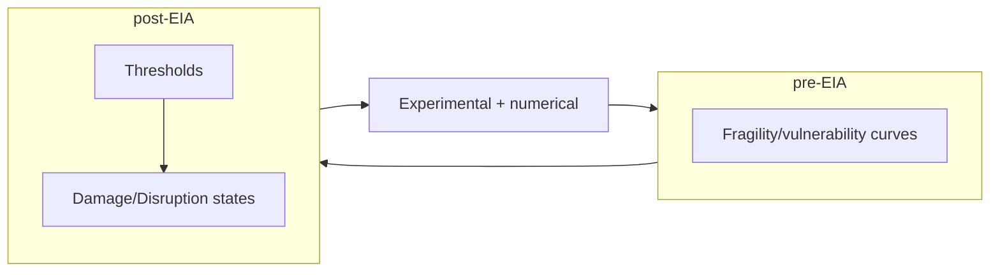

# The story of a pyroclast

!!! warning "Under work!"

    This online textbook is under work - this is just currently a stub!

**Pyroclastic deposits** result from the sedimentation of pyroclasts through the atmosphere plume during an explosive
eruption. **Pyroclast** - from Greek *pyros* (fire) and *clastic* (broken) represent fragmentary material ejected during a volcanic eruption. 

<!-- **Tephra deposits** are widespread deposits generated by explosive volcanic eruption (see Figures 1-5 for examples).  -->

The objective of this module explore the journey of a pyroclast from the magma chamber to its sedimentation on the ground and, through this, review the range of processes that generate tephra deposits. In another module, we will then learn **what we can learn** from these deposits.

## :material-format-list-checks:{ .icn } Objectives 

The objective of this lessons are to understand:

- How tephra is generated, transported and deposited on the ground 
- The nature of the physical processes taking place along this journey
- How tephra fall deposits are formed

## :fontawesome-solid-gears:{ .icn } General concepts

!!! info "Pyroclast and tephra"
    **Pyroclast** and **tephra** are more or less synonyms, but **tephra** is more frequently used in the scientific literature.

### Why are tephra deposits important?

Tephra deposits are **a direct reflection of the eruptive conditions** occurring in the plume (Figure 1). By **studying**, **mapping** and **characterizing** these deposits, we can reconstruct the dynamics of eruption and estimate important **eruption source parameters** (ESP). Following the general idea that *"the past is the key to the future"*, this ability is critical to reconstruct the eruptive history of volcanic systems from their stratigraphic record and, in turn, constrain their potential future activity.

<!-- !!! info "Field-based methods"

        For recent eruption, direct observation methods can infer ESP in near-real time (e.g., satellite imagery for plume height, infrasound for mass eruption rate (MER)). However, field-based approaches remain the main approach to extract knowledge from old tephra deposits. -->

<figure markdown>

<figcaption>Figure 1: Tephra deposits (right) are a direct consequence of the plume dynamics. On the left, the plume associated with the 2015 eruption of Calbuco, Chile (Picture: AFP). On the right, a tephra deposit associated with a Plinian eruption of Cotopaxi volcano, Ecuador (Picture: S. Biass).</figcaption>
</figure>

<!-- In the field, tephra deposits generally appear as unconsolidated *pyroclastic* material that are able to blanket the existing topography. Deposits follow the direction of the dominant wind during the eruptions. As a consequence, a short lasting eruption occurring in a single dominant wind pattern might elongate in a unique direction, whereas long(er)-lasting eruptions can be affected by variable wind profiles and present a less conspicuous unique dispersal direction. With distance from the vent:

- The thickness of deposits **decrease** exponentially.
- Their grain-size distributions become **finer**. -->

Below are some examples of tephra deposits.

=== "La Palma"

    <figure markdown>
    { width="400" }
    <figcaption>Figure 2: Tephra deposit associated with the 2021 eruption of La Palma for a section ~1km from the source. The layering reflects the variability of both eruptive and atmospheric conditions throughout the course of the eruption. In this section, the coarsest material is lapilli and the finest is ash (Picture: S. Biass). </figcaption>
    </figure>

=== "Kīlauea"

    <figure markdown>
    { width="400" }
    <figcaption>Figure 3: Proximal outcrop of the Golden Pumice deposit of Kīlauea volcano in Hawaii. This deposit is associated with episodes of intense fountaining (Picture: S. Biass).</figcaption>
    </figure>

=== "Vulcano"

    <figure markdown>
    
    <figcaption>Figure 4: Deposit associated with the 1888-1890 eruption of La Fossa volcano, Italy. This section represents years of unsustained, pulsatory Vulcanian activity (Picture: S. Biass).</figcaption>
    </figure>

=== "Changbaishan"

    <figure markdown>
    { width="400" }
    <figcaption>Figure 5: Deposit associated with the AD 946–947 Plinian Millenium eruption of Changbaishan volcano (China/North Korea). The airborne deposit lies on a lahar deposit (Picture: S. Jenkins).</figcaption>
    </figure>

=== "Taupō"

    <figure markdown>
    { width="400" }
    <figcaption>Figure 6: Complex stratigraphy associated with the Oranui eruption of Taupō volcano, New Zealand. This is the largest eruption of the past 70,000 years, with a VEI of 8 (Picture: S. Biass).</figcaption>
    </figure>


### What is tephra?

**Pyroclast** and **tephra** more or less describe the same thing. **Tephra** was first defined by Sigurður Þórarinsson[^1] following the 1947 eruption of Hekla volcano in Iceland as:

!!! quote "Definition"
    The fragmental material produced by a volcanic eruption regardless of composition, fragment size, or emplacement mechanism.

Tephra particles are typically described in terms of their **componentry** and **size**.

#### Componentry

Tephra fragments - or *pyroclasts* - can be classified in two main families depending on their **origins**:

- **Juvenile** clasts, which consider all clasts originating from fresh magma (e.g., pumice, ash)
- **Lithic** clasts, which represent dense clasts generally sourcing in country rocks.

#### Grain size

Individual tephra particles are also subdivided in term of their **size**:

<!-- - **Coarse ash**: particles smaller than 0.063 mm in diameter
- **Ash**: particles between 0.063 and 2 mm in diameter
- **Lapilli**: between 2 and 64 mm in diameter
- **Bombs** or **blocks**: larger than 64 mm in diameter -->

|                 | bombs / blocks | lapilli       | coarse ash          | fine ash             |
|-----------------|----------------|---------------|---------------------|----------------------|
| **Diameter**        | > 64 mm        | (64 mm–2 mm)  | ( >2 mm–63μm)       | <63μm                |
| **Residence time ** | ≈ sec          | ≈ min         | ≈ hours to few days | several days         |
| **Travel distance** | proximal <10km | medial <50 km | distal <100 km      | very distal <1000 km |


Following a sedimentology approach, particles size is generally described in $\Phi$ units:

$$
\Phi = log2(d [mm])
$$

=== "Ash"

    <figure markdown>
    
    <figcaption>Ash from the 2021 Cumbre Vieja eruption covering a sport field (Picture: S. Biass). </figcaption>
    </figure>

=== "Lapilli"

    <figure markdown>
    { width="400" }
    <figcaption>Golden Pumice deposit from Kīlauea, grading from coarse ash (bottom) to coarse lapilli (top). Notice Pelee's hair at the top (Picture: S. Biass).</figcaption>
    </figure>

=== "Bomb"

    <figure markdown>
    { width="400" }
    <figcaption>Large pyroclast from Kīlauea (Picture: S. Biass).</figcaption>
    </figure>


#### Grain size distribution

Rather than the size of individual particles, what interests us most is the **size distribution** within an outcrop. **Grain size distributions** summarise the **percentage of weight** represented by the particles in each $\Phi$ bin. We mostly describe two parameters[^2][^3][^4]:

- **Median** or $Md \Phi$: The 50th percentile ($\Phi 50$) of the distribution

    - &rarr; **Small** (even negative) $Md \Phi$ values describe **coarse** deposits
    - &rarr; **Large** $Md \Phi$ values describe **fine** deposits
  
- **Sorting** or $\sigma \Phi$: The graphical standard deviation ($(\Phi 84 - \Phi 16)/2$)

    - &rarr; **Small** $\sigma \Phi$ values describe **well-sorted** deposits
    - &rarr; **Large** $\sigma \Phi$ values describe **poorly-sorted** deposits

<figure markdown>
{ width="400" }
<figcaption>Example of variably-sorted deposits.</figcaption>
</figure>

!!! question "Which is the finest GSD?"
    

    ??? check "Solution"

        &rarr; The **left distribution** has a $Md \Phi$ of **-1** (i.e., 2 mm) and is therefore **coarser** than the **right distribution** ($Md \Phi$ of **1**, or 0.5 mm).

!!! question "Which is the better-sorted GSD?"
    

    ??? check "Solution"

        &rarr; The **left distribution** has a $\sigma \Phi$ of **1** and is therefore **well-sorted**. The **right distribution** ($\sigma \Phi$ of **1**) is **poorly-sorted**. Note that both distributions have the same $Md \Phi$.

### How are tephra deposits emplaced?

Look at the following two pictures and *formulate* hypotheses about **emplacement dynamics**:
=== "Mayon 1982"

    <figure markdown>
    
    <figcaption>1984 eruption of Mayon volcano, Philippines (Picture: C. Newhall). </figcaption>
    </figure>

=== "Sarychev 2009"

    <figure markdown>
    
    <figcaption>2009 eruption of Sarychev volcano, Russia ([Source](https://earthobservatory.nasa.gov/images/38985/sarychev-peak-eruption-kuril-islands)).</figcaption>
    </figure>

??? hint "Hint"
    Is emplacement **horizontal** or **vertical**?

    ??? check "Solution (?)"
        Well, maybe a bit of both...

We can consider **two main** mechanisms of emplacement:

- If the plume is **buoyant**, it will rise and become wind-advected, carrying tephra that will then sediment **vertically**, producing **fall deposits**.
- If, for any reason, the plume is not (or not anymore) buoyant (&rarr; bulk density exceeds that of the ambient atmosphere), **pyroclastic density currents** (or PDC) will spread **laterally**, producing **flow deposits.** PDC are complex mixtures of hot gases and particles that can be generated in several ways giving rise to several facies, the end-members of which being **surges** and **flows**.

=== "Fall and flows"

    

    Schematic representation of **fall** (left) and **flow** (right) emplacement mechanisms (Source: Carey and Bursik 2015[^5]). In the left case, the plume is sufficiently buoyant to extend upwards. In the right case, this buoyant state is not initially reached, and a lateral momentum develops to produce directed flows. Note that in some cases, PDC can re-entrain air and become buoyant after some runoff (bottom right), giving rise to co-PDC plumes.


=== "Types of PDC"

    

    PDC can be generated from a wide range of eruptions varying many scales, from small events (e.g., dome collapse) to large caldera-forming eruptions, which can produce *welded* deposits (i.e.; ignimbrites) (Source: Dufek et al. 2015[^6]).


!!! info "Lahars"

    We are starting to make a distinction between *vertical* (&rarr; fall) and *lateral* (&rarr; flow) emplacement mechanisms. There is however another *flow* emplacement mechanism: **Lahar**

##### **Block-and-ash flow** 

> Small volume pyroclastic density current deposit composed of mostly dense to moderately vesicular juvenile blocks in medium to coarse ash matrix. Mostly generated during collapse of lava domes.
   

<!-- !!! info "Volcanic explosivity index"

        { width="300", align=left }

        The **Volcanic explosivity index**[^2] - or **VEI** - is a *"measure"* of eruption size based on the **volume** of tephra produced during an eruption. Despites its limitations (i.e., it is a stepwise measure and largely aggregates small but frequent eruptive styles into a *non-explosive* category), it remains the most commonly used metrics. Bear in mind that its primary purpose was *communication*, and it does a great job at it. For measures that better account for the dynamics of eruption, the combined use of **magnitude** and **intensity**[^3] might be more appropriate. More information can be found [here](https://geology.com/stories/13/volcanic-explosivity-index/).  -->

<!--         
#### Field mapping toolbox 

These sketches provide an overview of the general process followed to characterize tephra deposits.

=== "Outcrop"
    { width="300", align=left }

    As we start the field characterisation of a deposit, we first look for **outcrops** where a given deposit is complete. At the outcrop level, we will start directly measuring a number of different physical quantities including:

    1. The deposit **thickness**.
    2. The diameter of the l**argest clast(s)** observed at this location.
    3. The **grain-size** distribution. 
    4. The **componentry** (e.g., ratio of *juvenile* vs *lithics* components, presence of free crystals or oxydised particles). 

    Note that following [Steno's laws of superposition](https://www.geologyin.com/2014/03/stenos-principles-of-stratigraphy.html), the base of the outcrop is **older** than the top. Therefore, any variability of these parameters in the vertical section indicates a **change** in **time** (either of eruption dynamics or wind conditions).

=== "Deposit"
    { width="300", align=left }

    As a sufficient number of outcrops is discovered and mapped, we can start plotting them on a map and **contour** the spatial extent of these properties. Two maps greatly interest us:

    1. **Isopach** maps contour the **deposit thickness**, which can be used to compute the deposit **volume** and associated VEI / magnitude.
    2. **Isopleth** maps contour the **largest clast** that is observed at a given outcrop, which can be used to estimate the **plume height** and associated MER and intensity.

=== "ESP"
    { width="400"}

    This process is the foundation of the field characterization of tephra deposits and help quantifying ESP[^4].

=== "Workflow"

    This workflow summarises the entire field-based characterisation of ESPs from tephra deposits.

    ```mermaid
    flowchart LR
    A3 --> A32[VEI]:::clasf
    A4 --> A42[Magnitude]:::clasf

    A1[Thickness]:::field ==> A2[Isopach] ==> A3[Volume]:::esp ==> A4[Mass]:::esp ==> F[Eruption duration]:::esp

    B1[Largest clast]:::field ==> B2[Isopleth] ==> B3[Plume height]:::esp ==> B4[Mass eruption rate]:::esp ==> F

    A2 --> A22["Thinning" rate]:::clasf
    B2 --> B22["Fining" rate]:::clasf

    C[Bulk deposit density]:::field -.-> A4
    D[Wind speed] -.-> B4

    B4 --> B42[Intensity]:::clasf

    classDef field fill:#cbdc3850, stroke:#cbdc38;
    classDef esp fill:#1f78b450, stroke:#1f78b4;
    classDef clasf fill:#984ea350, stroke:#984ea3;
    ```

    ```mermaid
    flowchart LR
        subgraph Legend [" "]
        l1[Field/outcrop measurement]:::field
        l2[Eruption source parameter]:::esp
        l3[Classification parameter]:::clasf
        end
    classDef field fill:#cbdc3850, stroke:#cbdc38;
    classDef esp fill:#1f78b450, stroke:#1f78b4;
    classDef clasf fill:#984ea350, stroke:#984ea3;

    ```


### What impacts can be caused by tephra?

!!! note "Tephra hazard"

    We will focus here on **airborne tephra**, considering the fraction that is entrained in the convective plume and advected by the wind and ignoring the hazard associated with pyroclastic density currents (PDC).

The impact of tephra can be classified in two broad categories:

1. The **atmospheric dispersal** can impact the air traffic as demonstrated by the 2010 and 2011 eruptions of Eyjafjallajökull (Iceland) and Cordón Caulle (Chile), respectively. In this case, the main **hazard impact metrics** (HIM) is the **atmospheric concentration** of fine ash in the atmosphere (usually expressed in $mg/m^3$). Since modeling the atmospheric dispersal requires 3D models with high computing costs, we won't consider this aspect here.
2. The **ground sedimentation** impacts populations and assets at the surface of the Earth, and the main **hazard impact metrics** are a combination of the **mass load** of tephra (usually expressed in $kg/m^2$) and the **grain-size distribution** of the deposit. This will be the focus of this exercise.

!!! example "Deposit load vs thickness"

    Measuring the mass load in the field is time consuming, and we are therefore often limited to measuring the outcrop's thickness. For simplicity throughout this exercise, we will consider that *mass load* and *thickness* can be interchanged using a bulk density of 1000 $kg/m^3$. So, for instance:

    - 1 $mm$ = 1 $kg/m^2$.
    - 1 $cm$ = 10 $kg/m^2$.
    - 10 $cm$ = 100 $kg/m^2$.
    - 1 $m$ = 1000 $kg/m^2$.

#### A spatially-dependent hazard intensity

Tephra deposits can extend 10's, 100's to 1000's of km away from the source. With distance from the vent, their **thickness** decrease **exponentially** and they gradually get finer. The **widespread** nature of tephra deposits and the **spatial evolution** of their associated hazard metrics make the associated impacts and risk **difficult to predict**[^5]. 

Impacts can be broadly characterised into 3 zones as a function of the distance from the vent [^6]:

- **Zone 1**: Destructive and immediately life-threatening.
- **Zone 2**: Damaging and/or disruptive.
- **Zone 3**: Disruptive and/or a nuisance.

<figure markdown>

<figcaption>Figure 7: Schematic of some ash fall impacts with distance from a volcano. This assumes a large explosive eruption with significant ash fall thicknesses in the proximal zone and is intended to be illustrative rather than prescriptive. Adapted from Jenkins et al. (2015). </figcaption>
</figure>

!!! info "A relative distance"

    The distance acting as a limit between these zones is *relative* and varies with the eruption style. The deposits of *large* (e.g. Plinian) eruptions will extend farther away than those of *smaller* (e.g. Vulcanian) eruptions, and the extent of zones 1-3 will vary accordingly.

#### Vulnerability and risk

Since the 70's/80's, a change of paradigm the concept of *vulnerability* as a cornerstone of volcanic risk[^7]. For the purpose of this exercise, let's consider that the risk $R$ can be defined as a function of at least 3 components that are:

- $H$ - **hazard** - expressing the spatial (and temporal) distribution of the intensity of a hazardous phenomenon.
- $E$ - **elements at risk** - expressing the presence of exposed populations, assets, goods, natural features, ecosystem services etc. to the hazardous phenomenon. 
- $V$ - **vulnerability** - expressing how the exposed element will be negatively impacted as a function of the hazard intensity. 

The most fundamental definition of risk is defined as $R = f(H,E,V)$. Although this exercise focuses on **hazard**, a meaningful discussion of hazard outputs usually borrows some concept of **vulnerability** to illustrate results. 

Ideally, all facets of vulnerability would be described by **continuous** and **quantitative** mathematical functions (also able to characterize the associated uncertainties). Amongst these, we distinguish between **fragility** and **vulnerability** functions (see below). These curves are typically primarily sourced in empirical **post-event impact assessments**, starting from *in situ* observations of impacts following disasters, and complemented with additional investigations (e.g., analytical, experimental, numerical).



Practically, the relatively low frequency of volcanic eruptions compared to other natural hazards limits the availability of opportunistic post-event impact assessments: this impedes the development of accurate, quantitative fragility/vulnerability functions. As a result, most current *vulnerability* models in volcanology rely on empirical **post-event impact assessments**, which are discrete, semi-quantitative scales based on hazard **thresholds** corresponding to the onset of specific observed impacts[^8]:

| Type                               | Description                                                                                                                                                                                                                                                             |
|:-----------------------------------|:------------------------------------------------------------------------------------------------------------------------------------------------------------------------------------------------------------------------------------------------------------------------|
| **Threshold**                      | Hazard intensity thresholds for onset of a given impact. Weak buildings are typically assume to start collapsing at tephra thicknesses of 100-300 $kg/m^2$, although this is highly dependent on the building morphology, quality and on the properties of the deposit. |
| **Damage/disruption states (DDS)** | Stepwise categorisation of impact as a function of hazard intensity. On example is to assume that pastoral agriculture can suffer production losses <50%, >50%, and total for accumulations of 25, 60 and 100 mm of tephra[^8].                                         |
| **Fragility function**             | Mathematical function expressing the probability of a level of impact being equalled or exceeded for a given hazard intensity[^8]. See Figure 9 for an example of fragility functions defined for composite European roofs[^9].                                         |
| **Vulnerability function**         | Same as the fragility function, but expressing a relative loss or economic cost to hazard intensity.                                                                                                                                                                    |

=== "Damage disruption state"

    <figure markdown>
    
    <figcaption>Figure 8: Example of damage/disruption states for ground crops (modified after Jenkins et al. 2015).</figcaption>
    </figure>

=== "Fragility function"

    <figure markdown>
    
    <figcaption>Figure 9: Example of fragility functions describing the probability of collapse for weak (WE), medium weak (MW), medium strong (MS) and strong (ST) roofs as a function of the tephra load.</figcaption>
    </figure>


!!! info "Other variables considered in risk estimates"

    Throughout the course, we are likely to discuss other actors of risk. Amongst them are:

    - **Resilience**, which is the opposite of vulnerability and describes the condition that will *reduce the negative* consequences of a natural hazard. 
    - **Cost**, which is required to express the risk as a monetary value.
 -->

<!-- 
## :material-thought-bubble:{ .icn } Food for thoughts

The [2015 edition of the Global assessment report](https://www.undrr.org/publication/global-assessment-report-disaster-risk-reduction-2015) (GAR) on disaster risk reduction report by the United Nations Office for Disaster Risk Reduction represents the first inclusion of volcanic risk within the UN risk framework. This testifies of the growing awareness of the potential global impact of future large eruptions on modern societies. Similarly, re-insurance companies are [beginning to include volcanic risk](https://www.preventionweb.net/publication/destructive-power-volcanic-ash-fall-quantifying-volcanic-risks-will-improve) in their portfolios and developing new dedicated products through, for instance, parametric risk transfer solutions[^10] and [CAT bonds](https://catbond.org/about/). 

Despites these new efforts, the complexity of the hazard associated with tephra fallout and the **full range of potential** impacts is often under-appreciated. This shortcoming is rooted in two main causes. On the one hand, eruptions are complex **multi-hazard** events. Each eruptions style is associated with specific hazards: for instance, the hazards associated with Strombolian eruptions are different than those associated with phreatomagmatic or Plinian events. These hazards evolve in space and time, creating **complex vulnerability patterns**. On the other hand, volcanic eruptions are *less frequent* than other natural hazards. As a consequence, and our empirical dataset of observations available to **predict** future impacts based on **past lessons** is more limited, which impedes the development of operational impact models.

The *Global Volcanic Hazards and Risk* book, [published in 2015](https://www.cambridge.org/core/books/global-volcanic-hazards-and-risk/7653B9CA75E2F32A81CE5B7110BEF8AB) in the context of the GAR report, contains a chapter entitled **Volcanic ash fall hazard and risk** by Jenkins et al.[^6]. This chapter is [freely accessible](https://www.cambridge.org/core/books/global-volcanic-hazards-and-risk/volcanic-ash-fall-hazard-and-risk/21EAC484CBDF5E5CB6F8E36D640BD2C3) online and offers a review of the impacts and proposes tentative damage/disruption states for key vulnerability aspects. Specifically:

- **Tables 3.2 &rarr; 3.5** illustrate the range of impacts as a function of the zones defined above.
- **Tables 3.6 &rarr; 3.8** propose damage/disruption states based on a comprehensive review of the literature.

This chapter provides the currently most useful and pragmatic compilation of available DDS related to the tephra hazard. We encourage you to get familiar with these values for the hazard and impact exercises in the lab and in the field!

## :material-check-bold:{ .icn } Summary

This introduction has introduced:

- [x] *what* are tephra deposits and 
- [x] *why* they matter, both from a perspective of **reconstructing** the **eruptive history** of volcanic systems and of their **associated impacts**. 

In the next sections, we will introduce how we can [model](Hazard_tephra_modeling.md) tephra deposit and assess their associated [hazards](Hazard_probabilistic2.md). -->

## :fontawesome-solid-book:{ .icn } References

[^1]: Thorarinsson, S., 1954. The eruption of Hekla, 1947-48, 3, The tephra-fall from Hekla, March 29th, 1947. Visindafélag ĺslendinga 1:3.
[^2]: Inman, D.L., 1952. Measures for describing the size distribution of sediments. Journal of Sedimentary Research 22, 125–145.
[^3]: Walker, G., 1971. Grain-Size Characteristics of Pyroclastic Deposits. The Journal of Geology 79, 696–714.
[^4]: White, J.D.L., Houghton, B.F., 2006. Primary volcaniclastic rocks. Geology 34, 677–680. https://doi.org/10.1130/G22346.1
[^5]: Carey, S., Bursik, M., 2015. Volcanic Plumes, in: Sigurdsson, H., Houghton, B.F., McNutt, S., Rymer, H., Stix, J. (Eds.), The Encyclopedia of Volcanoes. Academic Press, pp. 571–585. https://doi.org/10.1016/B978-0-12-385938-9.00032-8
[^6]: Dufek, J., Esposti Ongaro, T., Roche, O., 2015. Pyroclastic Density Currents. in: Sigurdsson, H., Houghton, B.F., McNutt, S., Rymer, H., Stix, J. (Eds.), The Encyclopedia of Volcanoes. Academic Press, pp. 617–629. https://doi.org/10.1016/B978-0-12-385938-9.00035-3

<!-- 
[^2]: Newhall, C.G., Self, S., 1982. The volcanic explosivity index (VEI)- An estimate of explosive magnitude for historical volcanism. Journal of Geophysical Research 87, 1231–1238.
[^3]: Pyle, D.M., 2015. Sizes of Volcanic Eruptions, in: Sigurdsson, H., Houghton, B., McNutt, S., Rymer, H., Stix, J. (Eds.), The Encyclopedia of Volcanoes. Academic Press, San Diego, pp. 257–264.
[^4]: Biass, S., Bonadonna, C., Houghton, B.F., 2019. A step-by-step evaluation of empirical methods to quantify eruption source parameters from tephra-fall deposits. Journal of Applied Volcanology 8, 1–16.
[^5]: Bonadonna, C., Biass, S., Menoni, S., Gregg, C.E., 2021. Assessment of risk associated with tephra-related hazards, in: Papale, P. (Ed.), Forecasting and Planning for Volcanic Hazards, Risks, and Disasters. Elsevier, pp. 329–378. 
[^6]: Jenkins, S.F., Wilson, T.M., Magill, C., Miller, V., Stewart, C., Blong, R., Marzocchi, W., Boulton, M., Bonadonna, C., Costa, A., 2015. Volcanic ash fall hazard and risk, in: Loughlin, S., Sparks, S., Brown, S., Jenkins, S., Vye-Brown, C. (Eds.), Global Volcanic Hazards and Risk. Cambridge University Press, pp. 173–222.
[^7]: Fournier d’Albe, E.M., 1979. Objectives of volcanic monitoring and prediction. J Geol Soc Lond 136, 321–326.
[^8]: Wilson, G., Wilson, T.M., Deligne, N.I., Blake, D.M., Cole, J.W., 2017. Framework for developing volcanic fragility and vulnerability functions for critical infrastructure. Journal of Applied Volcanology 6.
[^9]: Spence, R.J.S., Kelman, I., Baxter, P.J., Zuccaro, G., Petrazzuoli, S., 2005. Residential building and occupant vulnerability to tephra fall. Natural Hazards and Earth System Sciences 5, 477–494.
[^10]: Oramas-Dorta, D., Tirabassi, G., Franco, G., Magill, C., 2021. Design of parametric risk transfer solutions for volcanic eruptions: An application to Japanese volcanoes. Natural Hazards and Earth System Sciences 21, 99–113.  -->

*[ESP]: Eruption source parameter &rarr; most important initial conditions to a model
*[TGSD]: Total grain-size distribution
*[MER]: Mass eruption rate
*[VEI]: Volcanic explosivity index
*[HIM]: Hazard impact metrics
*[GAR]: Global assessment report
*[DDS]: Damage-Disruption states &rarr; one way of characterising vulnerability
*[GVP]: Global volcanism program 
*[GSD]: Grain size distribution
