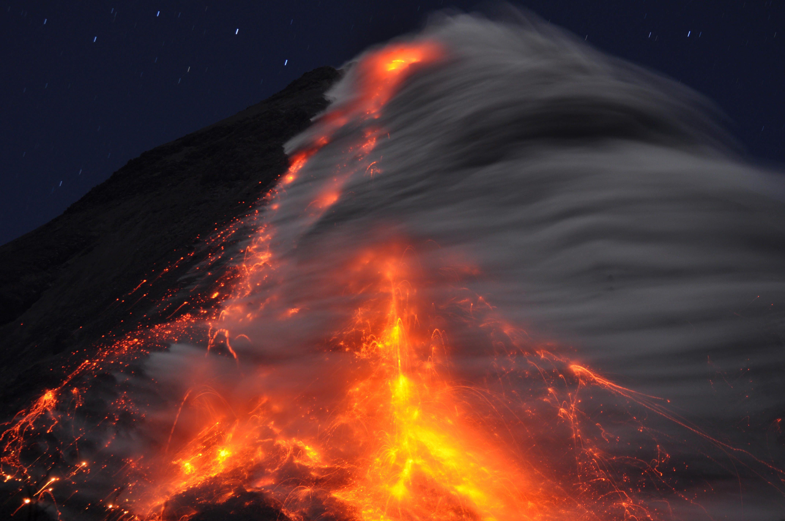

# Teaching

## Bachelor

### 2nd year

- [Physical Volcanology](Bachelor/2ndYear/PhysicalVolcanology/index.md)

### 3rd year

- [Risques géologiques module Risques volcaniques](Bachelor/3rdYear/RisquesGeologiques/index.md)

## Master

- [Modelling Volcanic Processes](Master/Modelling-volcanic-processes/index.md)

## CERG-C

- [Volcanic Risk module](CERG/index.md)

--- 

<figure markdown>
  
  <figcaption>Dome collapse at Colima volcano, Mexico (picture: S. Biass).</figcaption>
</figure>