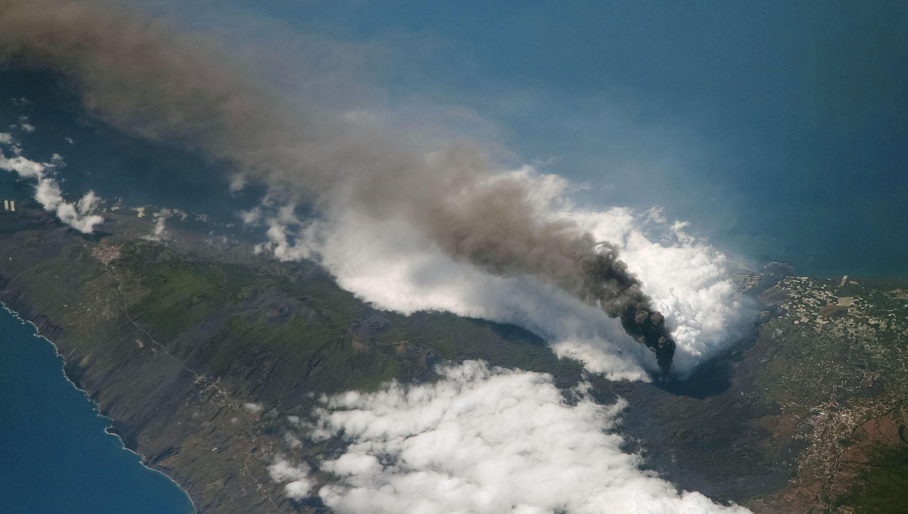

# CERG-C 

> This module is developed by Sébastien Biasse, Lucia Dominguez, Corine Frischknecht and Costanza Bonadonna.

---

This page contains the teaching material for the Physical Volcanology and Volcanic Risk modules of the CERG-C. It contains both **theory** and the **exercises**, which will get you started for the week in the field in La Palma. The module contains the following classes:

- [Theory behind hazard assessments and hazard maps](HazardMaps/index.md)
- [Hazard assessment for lava flows](Lava/index.md) 
- [Hazard assessment for tephra fallout](Tephra/index.md)

--- 

<figure markdown>
  
  <figcaption>The 2021 eruption of Tajogaite on La Palma viewed from the International Space Station on October 4, 2021 (<a href="https://earthobservatory.nasa.gov/images/148946/eruption-continues-at-la-palma", target="_blank">Source</a>).</figcaption>
</figure>