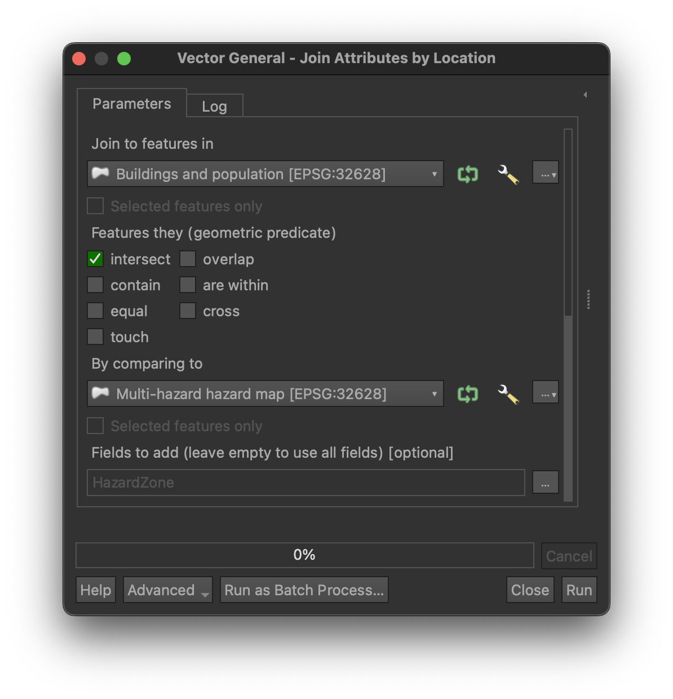
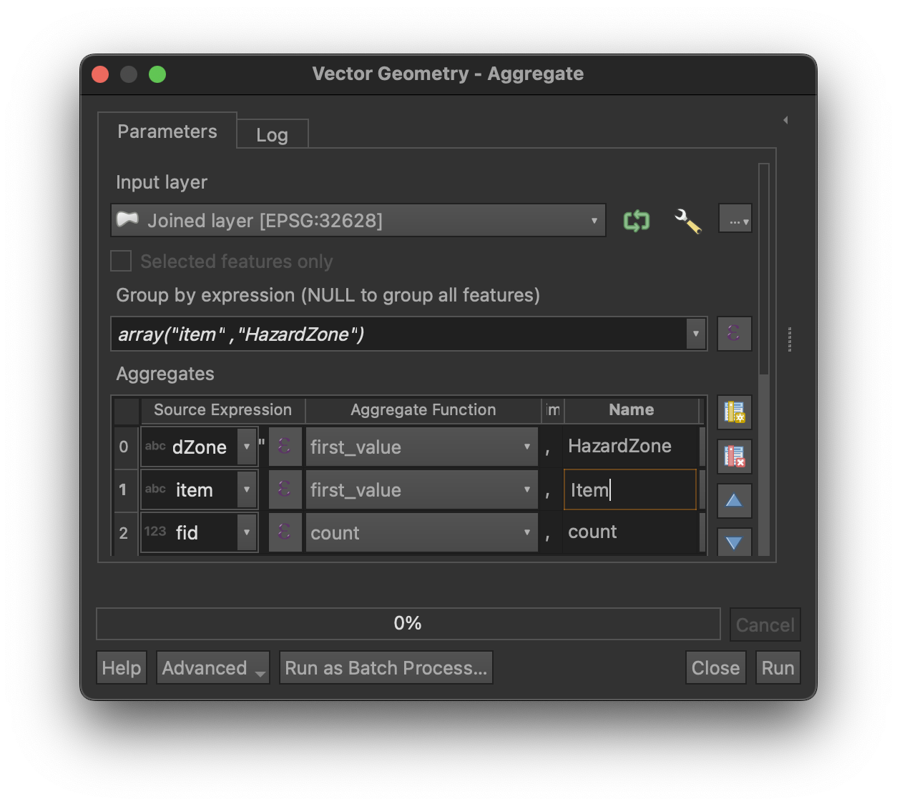
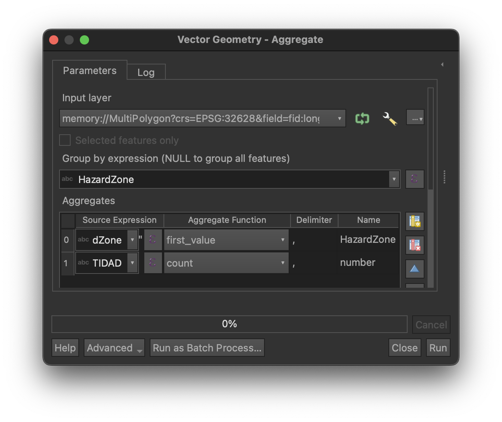

# Hazard and exposure exercise

!!! danger "This is an exercise!"

    Keep in mind that all hazard, exposure and vulnerability data provided in this exercise are **fictitious** and only designed for an educational purpose.

## :material-head-flash:{ .icn } Background

Following the unrest along the Cumbre Vieja ridge over the past weeks and the subsequent raise to Yellow alert, the international multidisciplinary scientific committee assembled to support PEVOLCA (i.e., you!) has now completed the field investigations required to conduct the hazard assessment[^1]. Over the past two days in the field, you have gained an understanding of the geological and geographical setting of the island, learning about recent eruptions, their associated hazards and impacts. Specifically, you have gained an overview of possible impacts by observing the consequences of past eruptions at the island scale and on the exposed systems and their interconnectivity. Based on this knowledge, you will today present the result of your hazard assessment for the two main hazards associated with your attributed eruption scenario and provide a first estimate of the nature and the number of assets exposed to various hazard intensities.

You are divided into five groups, each group forming a different interdisciplinary team and focusing on an hypothetical eruption from a different source along the Cumbre Vieja ridge. From an impact perspective, all groups will consider buildings and population and *additional* systems: 

| **Group**   | **Primary system**                      | **Interconnected system**                  |
|-------------|-----------------------------------------|--------------------------------------------|
| **Group 1** | Electrical power                        | Critical facilities (emergency)            |
| **Group 2** | Terrestrial and maritime transportation | Agriculture                                |
| **Group 3** | Water supply                            | Agriculture                                |
| **Group 4** | Terrestrial and aerial transportation   | Tourism                                    |
| **Group 5** | Terrestrial transportation              | Critical facilities (education, bus lines) |

## :fontawesome-solid-folder:{ .icn } Available material

!!! warning "Clear some data"

    Each group is provided with a GIS project (`LaPalma_basemap_exercise.qgz`) containing the hazard and exposure data **for all groups**. To avoid running into problems, **please remove the data associated with other groups** and keep only those related to yours.

### Hazard data

For the hazard data, you are provided with the result of the probabilistic hazard modelling.

#### Tephra 

- `Probability maps`: [Probability maps](../Tephra/Hazard_probabilistic2.md#__tabbed_4_1) (%) to exceed specific tephra accumulation
- `Probabilistic isomass maps`: [Probabilistic isomass maps](../Tephra/Hazard_probabilistic2.md#__tabbed_4_2) (kg/m²) for a given probability of occurrence of the hazard 
- `Points group X`: Locations of [hazard curves](../Tephra/Hazard_probabilistic2.md#__tabbed_4_3). In the folder `GroupX` (i.e., not in QGIS), there is also an Excel file called `tephra_hazard_curves.xlsx` containing the hazard curve data for specific locations in your area

#### Lava

- `Lava inundation probability`: Probability of lava flow inundation (%)
- `Flow outline`: A lava flow outline corresponding to an inundation probability ≥ 0.1%

#### Multi-hazard hazard map 

In addition, we have prepared **a multi-hazard hazard** map (`Multi-hazard hazard map` layer) that defines four zones based on the assumptions below. Hazard zones I-V are stored in the `HazardZone` field.

| **Hazard zone** | **Hazard threshold**                                                                         |
|-----------------|----------------------------------------------------------------------------------------------|
| **Zone I**      | Tephra accumulations ≥ 1 kg/m² (considering a 25% probability of occurrence of the hazard)   |
| **Zone II**     | Tephra accumulations ≥ 10 kg/m² (considering a 25% probability of occurrence of the hazard)  |
| **Zone III**    | Tephra accumulations ≥ 100 kg/m² (considering a 25% probability of occurrence of the hazard) |
| **Zone IV**     | Tephra accumulations ≥ 300 kg/m² (considering a 25% probability of occurrence of the hazard) |
| **Zone V**      | Probability of lava flow inundation ≥ 0.1% (i.e., one chance in a thousand)                  |

### Exposure data

The QGIS project also contains exposure data for all groups, which you can view as the result of a preliminary, rapid assessment of the exposed elements on the island. All exposure layers contain hazard information extracted for the specific location of each asset contained as three fields of the attribute table:

- `lava_probability`: Probability of lava flow inundation (%)
- `tephra_load_25pct`: Tephra load (kg/m²) extracted for a 25% probability of occurrence
- `tephra_load_75pct`: Tephra load (kg/m²) extracted for a 75% probability of occurrence
 
All groups contain a layer with the buildings footprints (`Buildings and population` layer) with the number of residents in each household (`POP_resid` field). In addition, you are provided with specific layers for each group related to the systems you must consider. The folder also contains an Excel file containing the description of all the attributes of the exposure layers (`Exposure_metadata.pdf`).

## :fontawesome-solid-gears:{ .icn } Exercise 

The objective of the exercise is to produce a poster that **presents the results of your hazard assessment** and put them in the **perspective of the nature and number of assets exposed** to the  volcanic hazards. Your presentation should cover the following topics:

- [ ] Explain the underlying eruption scenario and the main assumptions used to conduct the probabilistic hazard modelling
- [ ] Present the result of the hazard assessment in the perspective of the resulting exposed asset. Find a narrative and be creative - communicating results is an integrant part of the challenge!
- [ ] Answer the hazard-related question specific to your group
- [ ] Provide any recommendation regarding what attributes are missing/required to characterise vulnerability, and narrow down a few that you will investigate during the next field campaign (i.e., tomorrow)

!!! tip "Work as a *team*"

    Keep in mind that each group represents a multidisciplinary team. It is important to work as a team and exploit the strength of each member. Before rushing head first into the exercise, please take a moment for all of you to i) read the exercise until the end and ii) open the GIS project, look at the layers and **review their attributes**. When you have a global understanding of the exercise and the available data, it is probably a good idea to discuss splitting tasks between group members.

### Task I: Hazard assessment 

The objective of this task is to present the **assumptions** behind the probabilistic hazard modelling you performed for both tephra fallout and lava flows. Refer to the online classes on [tephra](../Tephra/Hazard_tephra_exercise.md) and [lava](../Lava/Hazard_lava_Q-LavHA_exercise.md) for references.

#### :fontawesome-solid-caret-right:{ .icn } Required output

1. Present the assumptions behind the eruption scenarios - you can use some of the figures produced in class if needed
2. Reproduce the **multi-hazard hazard map** on two transparent papers, both for the *island* scale and for the *local* area defined for your own group
3. Draw the **hazard curves** for the locations associated with your group (see Table below). It is probably a good idea to clearly show these locations on a map too!
4. Explain the spatial distribution of hazards (e.g., in which direction is the hazard going? what is the shape of the hazard footprint? what controls direction and shape? how far from the source is the hazard footprint extending from the vent?)
5. Put the hazard assessment in the context of **exposure** (see [Task 2](#task-ii-exposure-analysis))

!!! hint "Know your audience!"

    Remember that you are communicating assumptions behind and results of the hazard assessment to PEVOLCA, who are not experts in the topic. *Know your audience:* carefully choose *what assumption* you want to communicate. Also remember that the *symbology* used in maps conveys some important information. Don't get lost in over-technical details!

### Task II: Exposure analysis

The objective of this task is to identify the population and asset exposed to tephra fallout and lava flows. For this, you will need to quantify how many people and assets are contained within each zone of the multi-hazard hazard map. All groups should quantify i) the number of buildings and number of residents located in each hazard zone. Then, each group should quantify the exposure of their attributed system.

Take some time to investigate the provided exposure layers. Namely:

- What is the *geometry* of each layer (i.e., `point`, `polyline`, `polygon`)?
- What is the *spatial distribution* of the assets (e.g., density, clusters)?
- What is contained in the attribute tables? For instance, what are the values in each field? Are they *numerical* or *categorical*?

#### Methodology

In QGIS, start by displaying the `Processing Toolbox`:

- For **Windows/Linux**: ++ctrl++ + ++alt++ +T
- For **macOS**: ++cmd++ + ++opt++ + T

Conceptually, two steps are required to analyse exposure:

1. Extract the hazard zone at the location of each asset
2. Quantify how many assets are located in each hazard zone 

##### 1. Extract the hazard zone for each asset

This step retrieves the hazard zone in which each asset is located and adds it as a new feature to the exposure layer. The hazard zone is stored in the `HazardZone` field of the `Multi-hazard hazard map` layer. For `polyline` geometries, note that the method retrieves the maximum hazard zone along an edge.

In the `Processing Toolbox`, search for the `Join attribute by location` tool:

- **Join to feature in**: The exposure layer
- Choose **Intersect** 
- **By comparing to**: The multi-hazard hazard map
- **Fields to add**: Select `HazardZone`

This creates a new file of the same geometry as the input exposure layer that contains a new field called `HazardZone`. You can copy the symbology from the multi-hazard hazard map and paste it on the newly created layer for comparison. For this:

- Right-click on `Multi-hazard hazard map` and choose `Style` > `Copy Style` > `All Style Categories`
- Right-click on the exposure layer and choose `Style` > `Paste Style` > `All Style Categories`
    

!!! warning "Temporary layers"

    If you don't specify a path and a name to the output layer generated by tools in QGIS, it will automatically save them as temporary layers. To save them, right-click on the layer in the `Layer` panel and choose `Make permanent`.

<figure markdown>
{width='450px'}
<figcaption>Join attribute by location window.</figcaption>
</figure>

##### 2. Quantify asset exposure

This step quantifies the exposure of populations asset in each hazard zone. Think carefully which operator is required for each type of exposure layer. Typically, `point` geometries must be aggregated using the *count* function. Some `polygon` geometries also need a *count* (i.e., number of buildings), but perhaps other aggregation function need to be used in different contexts (e.g., population per building). For `polyline` geometries, we are typically interested in the exposed length.

In the `Processing Toolbox`, search for the `Aggregate` tool:

- `Input layer`: The layer created at the previous step
- `Group by expression`: The categorical field used for aggregation (i.e., `HazardZone`)
- In the `Aggregate` window, delete all fields if any are present.
- Add a first field that will be used as an *index*. In this case, we want to use the hazard zone as the index. Structure it as such:
    - `Source expression`: `HazardZone`
    - `Aggregate function`: `first_value`
    - `Name`: Hazard zone
- Then add the the field you would like to aggregate.
    - `Source expression`:
        - To *count* assets, select **any field**
        - To *sum* values contained in a specific field, select the relevant field
        - To estimate the **length** of polylines or the **area** of polygon, *expressions* are required:
            - **Length**: `length(@geometry)`
            - **Area**: `area(@geometry)`
            - In both cases, remember that the unit of the resulting quantity is the same as the unit of the coordinate system of the project
    - `Aggregate function`: `sum`
    - `Name`: The name of the field in the created layer

This creates a new layer that has no geometry information. Inspect its attribute table to display the result of the aggregation.

??? tip "Aggregate using multiple fields"

    If you want to aggregate using multiple attributes (e.g., count the crop type in each hazard zone), we need to use an **expressions** for the grouping condition:

    - `Group by expression`: `array("HazardZone", "item")`, where `item` is the name of the secondary attribute to use (e.g., `crop_type`). Note that both fields must be **categorical** (e.g., contain text or discrete values, not continuous values).
    
    Secondly, create **a second index field** (i.e., a second column in the created layer that will contain the other categorical attribute used to further split aggregation):

    - `Source expression`: `field_name` (e.g., `crop_type`)
    - `Aggregate function`: `first_value`
    - `Name`: Name of the seconday index column (e.g., `crop`)

    Finally, add a the field to aggregate as above.

    <figure markdown>
    {width='450px'}
    <figcaption>Aggregation using more than one grouping variable.</figcaption>
    </figure>

<figure markdown>
{width='450px'}
<figcaption>Aggregate window.</figcaption>
</figure>

!!! tip "If you want to explore even more..."

    There are several options that can be used to further explore what is contained in each field and derive some more detailed statistics.

    **Option 1:** Statistics Panel 

    - From `View` > `Panel`, activate the `Statistics Panel`. This provides some basic statistics for each field.
    
    **Option 2:** Export the data 

    - In the `Layers` panel, right-click on the layer you want to export and choose `Export` > `Save Feature As`. In the `Format` dropdown menu, choose `Comma Separated Value [CSV]`. You can then open this in any software to perform further statistical exploration.

    **Option 3:** Data Plotly Panel

    - From `Plugin` > `Manage and Install Plugins`, install the `Data Plotly` plugin. The `Data Plotly` panel allows plotting various types of plots.

#### :fontawesome-solid-caret-right:{ .icn } Required output

1. Find a creative way to **display** and **communicate** the results of your exposure analysis. Plots are a good idea, or maybe tables? In any case, make sure that the fonts are large enough for the audience to read them. You should **at least** present the exposure analysis associated with the different hazard zones.
2. If you have time, it might be a good idea to also illustrate the **variability** of your exposure analysis associated with the **uncertainties** of your hazard assessment? If you decide to do so, **focus on tephra** and on **the following thresholds**:

      - **Group 1**: 10 kg/m² 
      - **Group 2**: 10 kg/m² 
      - **Group 3**: 1 kg/m²  
      - **Group 4**: 1 kg/m²  
      - **Group 5**: 100 kg/m² 

!!! tip "What type of plot?"

    Several types of plots exist - and each type of data calls for a different one. For instance:

    - [Histograms](https://python-graph-gallery.com/histogram/) are useful to show the **distribution** of **continuous** values
    - [Barplots](https://python-graph-gallery.com/barplot/) can help [ranking](https://python-graph-gallery.com/pie-plot/) values and work well with **categorical** data
    - [Spider](https://python-graph-gallery.com/radar-chart/) plots can serve a similar purpose
    - [Donut](https://python-graph-gallery.com/donut-plot/) or [pie charts](https://python-graph-gallery.com/pie-plot/) are good to illustrate **a proportion of a whole**

    Also - make the plots as easy to read as possible: adding the raw value to some of the plots is often a good idea.

### Task III: Specific hazard questions

We saw that gas can be an important hazard both during and after an eruption. Modelling the gas hazard goes beyond the scope of this exercise, but please take a moment to reflect on the following questions: 

| **Group**   | **Question**                                                                                                  |
|-------------|---------------------------------------------------------------------------------------------------------------|
| **Group 1** | Which hazardous gases are more likely to be associated with an eruptive event?                                |
| **Group 2** | Which hazardous gases do you expect to find in the (a) crater fumaroles (b) and in the flanks of the volcano? |
| **Group 3** | What parameters control the dispersion of gas in craters? And in diffuse degassing areas?                     |
| **Group 4** | Which are the volcanic gases that may act as toxic and irritant?                                              |
| **Group 5** | Which are the volcanic gases that may act as asphyxiant?                                                      |

#### :fontawesome-solid-caret-right:{ .icn } Required output

- You do not need to add anything on the poster, but answer the question attributed to your group orally during your presentation

### Task IV: From exposure to vulnerability

With this exercise you have completed **hazard** and **exposure** analyses, which are the two first components of **risk**. However, a risk analysis also requires quantifying **vulnerability**. We have seen [here](../Tephra/index.md#vulnerability-and-risk) that vulnerability captures all aspects that contribute to adverse consequences of a natural phenomenon (e.g., a weak roof is more likely to collapse from tephra fallout than a strong one), and is *ideally* represented by a continuous function linking hazard intensity to a negative outcome. For systems, we have also seen in class that a **physical impact** can lead to a **loss of functionality**, which might affect an entire system - even where the hazardous phenomenon was not present.

Constraining vulnerability is difficult. However, looking at the attributes contained in the exposure layer, take some time to think about a field strategy to collect data attributes that you think is missing and/or require improvement.

#### :fontawesome-solid-caret-right:{ .icn } Required output

- For buildings, population and for the systems attributed to your group, suggest a couple of parameters for each that you would prioritise collecting in order to take your exposure analysis to a vulnerability assessment. Present this orally.

[^1]: Ok, we should have done it before we actually conducted the hazard assessment in class and it should have taken more than two days, but hey, let's pretend