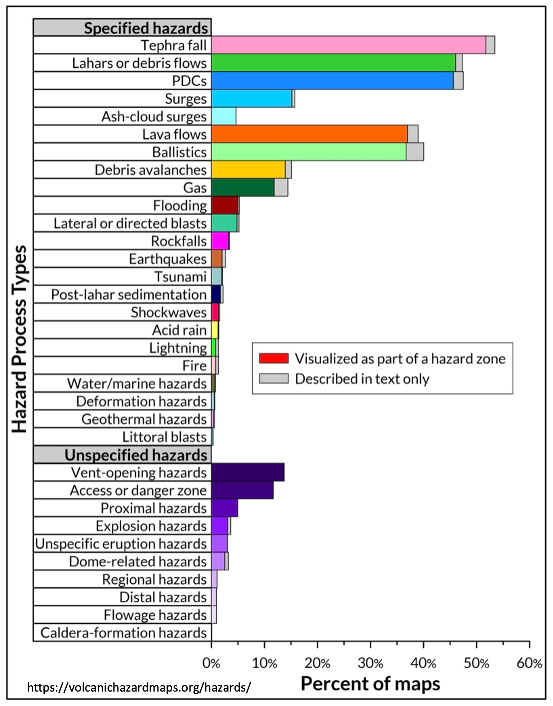
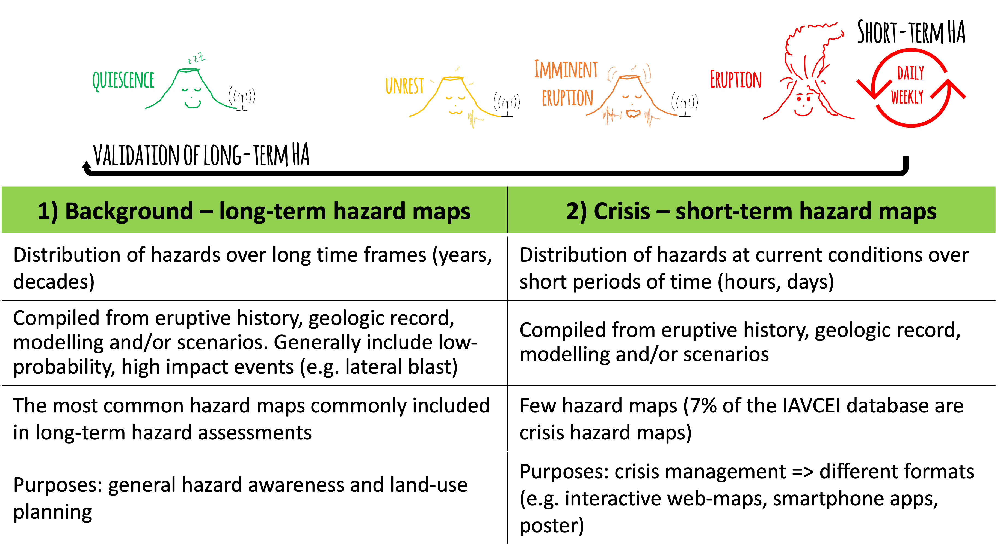
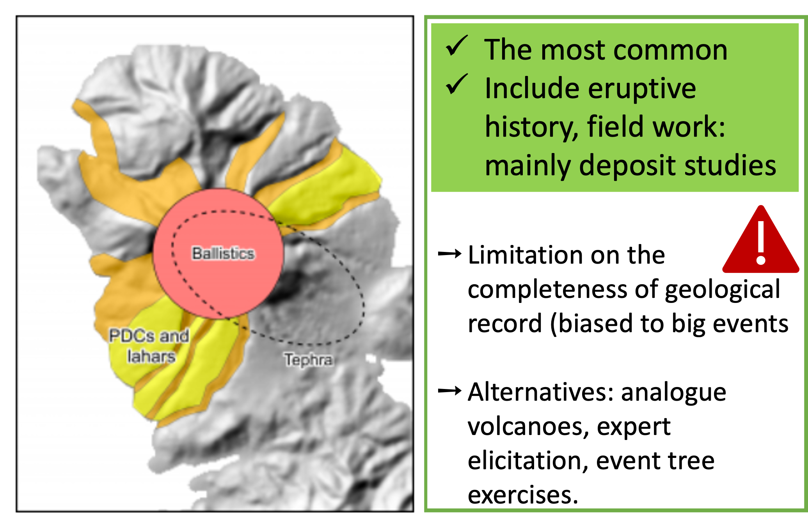
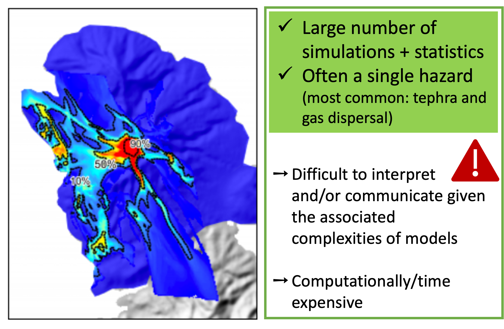
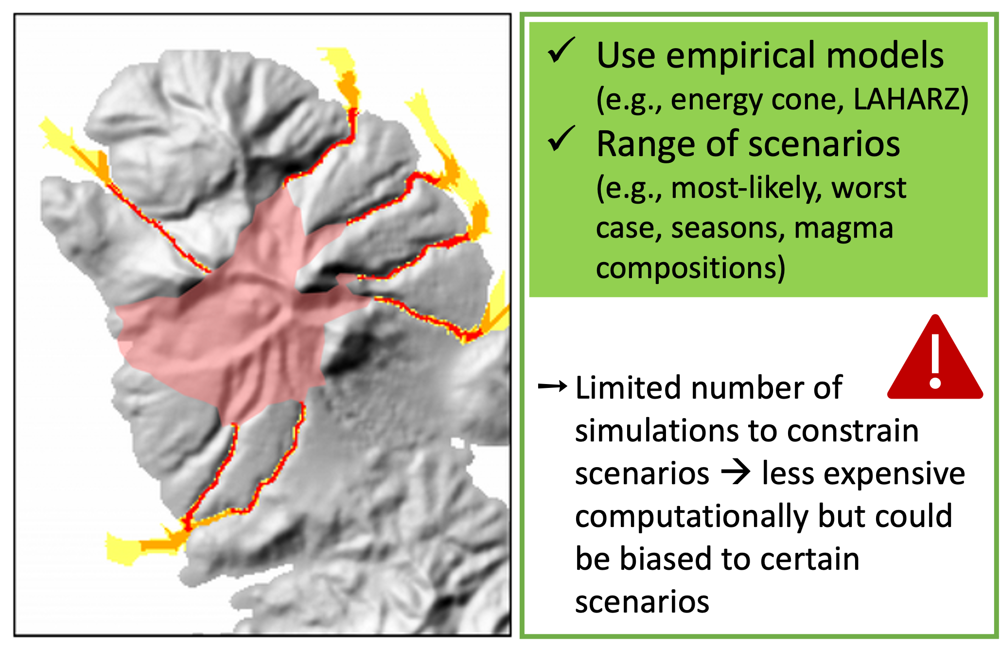
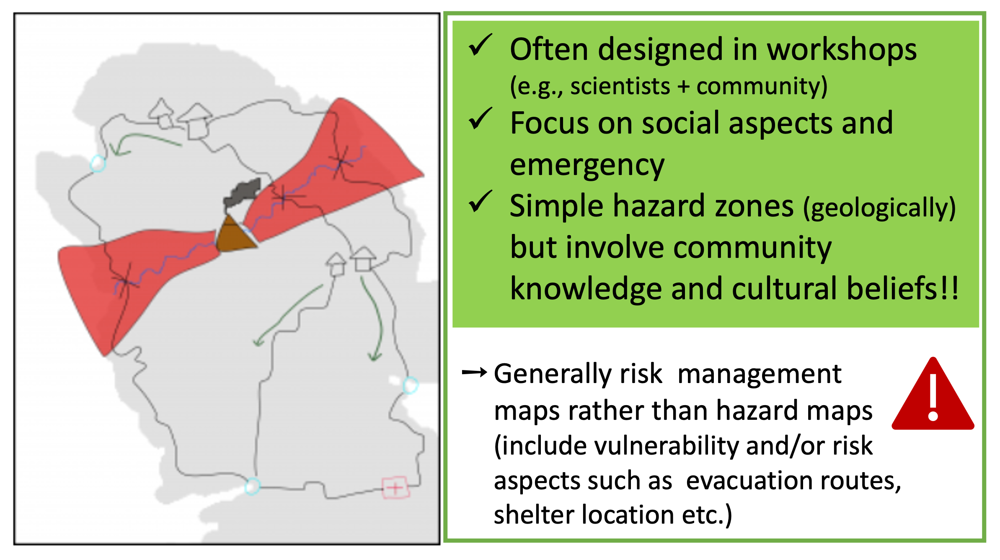
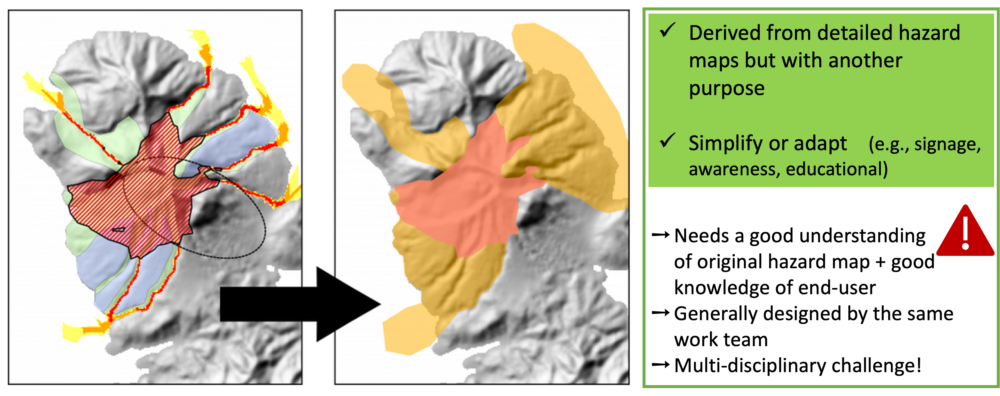
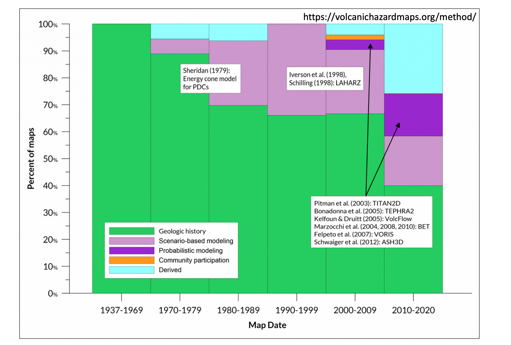
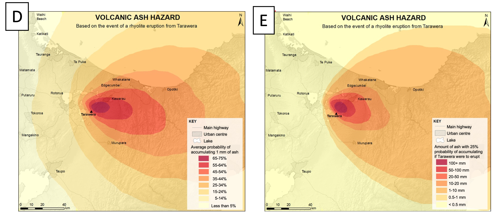
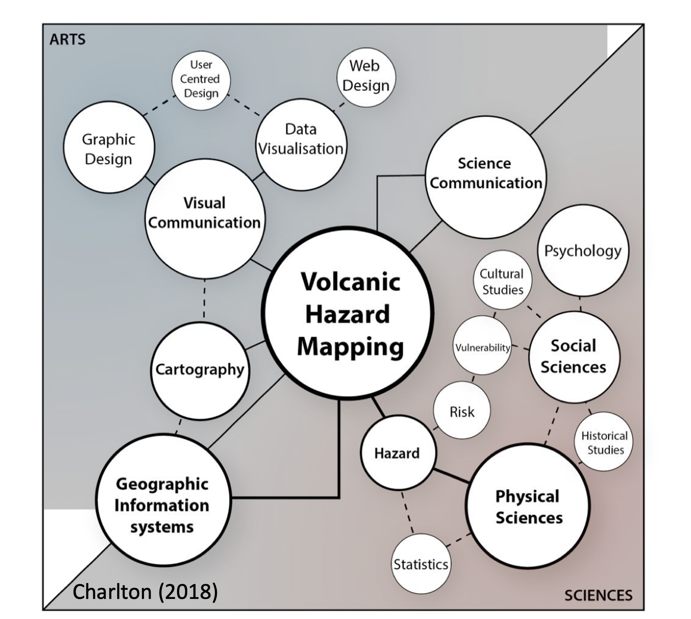

## :material-format-list-checks:{ .icn } Objectives

- Read, understand and interpret **hazard maps**. 
- Identify the main **types** of hazard maps and their importance.
- Recognize the role of **map design** on hazard communication.
  
## :fontawesome-solid-gears:{ .icn } What is a hazard map and why is important?

A hazard map is a spatial representation of the footprint of a given volcanic phenomenon. The number of elements and design of the map play a key role on hazard communication. 

!!! question "What's the secret code behing hazard map lines?"
    What could you say about the meaning of the lines displayed in this screenshot of the Mt. Iwate volcanic disaster prevention map?
    <figure markdown>
    { width="300"}
    <figcaption>  </figcaption>
    </figure>

    A clear meaning of each line in a map is fundamental for the reader to understand the message. Discover the legend and additional information of the [Mt. Iwate hazard map](https://vivaweb2.bosai.go.jp/v-hazard/L_read/27iwatesan/27iwate_1h02-L.pdf) in its complete version.
    

A hazard map must include:

:white_check_mark: The **inundation** of the area that can be potentially reached. It could be the surface covered by a deposition of pyroclastic material (e.g., sedimentation of tephra); and/or the areas affected by the path of the phenomena itself (e.g., the flow passage). 

:white_check_mark: Estimation of the **hazard intensity metrics** (e.g., tephra mass load [kg/m2], lahar dynamic pressure [kPa], ballistics impact energy [J]). 

!!! warning "Hazard maps are indispensable to communicate the distribution, intensity and/or magnitude of hazards. They are crucial to target the areas that can be potentially exposed to volcanic phenomena and therefore, to inform decision-makers in order to develop risk and crisis management strategies such as evacuation plans, prioritisation measures, future building codes, etc."

## :fontawesome-solid-gears:{ .icn } Types of hazard maps

As part of the International Association of Volcanology and Chemistry of the Earth’s Interior [IAVCEI], the special Commission on Volcanic Hazard and Risk has been working during the last decade to ensure better practices on how we define and display volcanic hazards. One of the major topics involving an invaluable amount of work is the compilation and organization of more than 1800 maps in the catalogue [Volcanic Hazard Maps](https://volcanichazardmaps.org/). 

Initially, Calder et al. (2015)[@Calder2015] classified hazard maps in 5 main categories: 
<figure markdown>
{ width=100% }
<figcaption> Five main types of hazard maps according to Calder et al. (2015)[@Calder2015] </figcaption>
</figure>

However, with the increase of number of maps and a deeper understanding of methodologies, it was rapidly understood that the complexity associated with various volcanic phenomena, most of times, for the same volcano, required a **more comprehensive categorisation**. For this reason the [Volcanic Hazard Maps](https://volcanichazardmaps.org/) database was developed as an answer to a basic need in volcanology. Details on how this database has been constructed are available in Ogburn et al. (2023)[@Ogburn2023]. 

The diversity of maps has been therefore classified in 10 aspects in a very versatile database: hazard process type, hazard zone presentation, temporal scale, spatial scale, publication format, zonation methodology, scenario types, hazard zone labels and probability definition, purpose and audience, language, map design and cartographic elements. 

For this lecture, we will only focus on the maps classified by hazard process type, spatial and temporal scales and hazard zonation methodologies, but you can of course spend some time exploring all this [diversity](https://volcanichazardmaps.org/the-diversity-of-volcanic-hazard-maps/). 

### Hazard process type

!!! question "What volcanic hazard do you think is the most frequently represented in maps?"

??? note "Maps per type of hazard"

    <figure markdown>
    { width="300" }
    <figcaption>  </figcaption>
    </figure>

    The amount of published hazard maps is related to the **frequency of phenomena**: 
    
       - events with **high probability** of occurrence are the **most represented** in maps: tephra fallout, pyroclastic density currents and lahars followed by lava flows and ballistics. 
       - **low probability** hazards are **less studied**, but they are often the most impactful ones!!: debris avalanches, lateral blasts; or long-lasting secondary hazards: floods, tsunamis, fire.

    Certain volcanic phenomena are more understood (e.g., PDC, tephra) and/or certain volcanoes are more studied (better monitored).

!!! warning "**A significant difference respect to other natural hazards is that the same map can display 1 single or several hazards due to the multi-hazard nature of volcanic eruptions!!**"
    
  
### Space and time scales

Depending on the knowledge of a given volcano, and the characteristics of the [hazard assessment](hazard_assessments.md), maps can be designed during the volcano in quiescence (background activity &rarr; long-term hazard assessments) or during the eruption (crisis &rarr; shor-term hazard assessments). There are hence 2 main categories: **short** and **long-term** hazard maps. Information about the objectives of the map (purpose) and/or time indicators are evidences of the temporal scale applied in the elaboration of the map. 

On the other hand, depending on the level of detail and again, in the purpose, a hazard map can specifically focus on specific flanks of the volcano, on the volcano itself or on a regional surface showing larger inondated areas. 

=== "Spatial scale"

    <figure markdown>
    { width="600" }
    <figcaption> 

=== "Temporal scale"

    <figure markdown>
    { width="600" }
    <figcaption> 

The **purpose** and **target audience** of the map is crucial to design a map in the **correct** space and time **scales**. One might expect a highly detailed and continuously updated hazard map when analysing the evacuation routes of a small town. Contrastingly, a regional -often international- scale might be expected when analysing the concentration of ash in the atmosphere for aviation disruption. 

!!! warning "The multiplicity of potential users involved in hazard and risk encourages **better communication tools** and **co-designing** strategies among stakeholders!!"

### Hazard zonation methodology

One of the major challenges of volcanic hazard assessments [HA] is the methodology to delimitate hazard zones. 

!!! question "What does it mean?"

    Once we get the outcomes of [HA], we need to decide what would be the **hazard zones!** 

    In other words... 

    Ideally, the main [HA] outcome involves the understanding of past activity of a given volcano as well as the potential future scenarios. In one way or the other, all [HA] are based on the geologic history of the volcano, but currently these assessments are completed more and more by numerical models; and more recently by community participatory approaches. 
    
    The outputs of these assessments provide the raw data about extension and hazard metrics...the challenge consists to decide how to select hazard thresholds out of those... where to draw the **low, medium and high** hazard zones!. 

Ogburn et al. (2023)[@Ogburn2023] identified 5 main categories of zonation methodologies: 

=== "Geologic history"

    <figure markdown>
    { width="400"}
    <figcaption> 

=== "Probabilistic modelling"

    <figure markdown>
    { width="400" }
    <figcaption> 

=== "Scenario-based modelling"

    <figure markdown>
    { width="400" }
    <figcaption> 

=== "Participatory or Community-based"

    <figure markdown>
    { width="400" }
    <figcaption> 

=== "Derived or simplify"

    <figure markdown>
    { width="600" }
    <figcaption> 

Volcanic hazard assessments and the amount of hazard maps are continuously increasing and are a crucial topic of researchers and risk managers. 

According to Ogburn et al. (2023)[@Ogburn2023], early maps, in the 60s, were practically all geology-based. Then, empirical models of physical processes, in particular the energy cone model of Sheridan in 1979[@Sheridan1979] marked a before and an after in volcanic hazard assessments. During the 70s to 90s, a large number of maps were developed based on scenario-based modelling. 

Since 2003, when physical models could be run probabillistically, a massive wave of knowledge and computing resources were developed, resulting in a large number of probabilistic maps (particularly for lahars: LAHARZ, TITAN2D; and tephra: TEPHRA2, ASH3D). 

Finally, and as a response of community and risk managers needs, the design of derived maps attracted considerable the interest since 2010s. This has been particularly fostered by the [US Geological Survey in the Cascades volcanoes](https://www.usgs.gov/media/galleries/cascades-volcanoes-simplified-hazards-maps) and the [Japan Meteorological Agency](https://www.jma.go.jp/bosai/map.html#5/38.135/147.129/&contents=volcano&lang=en) to standardize eruption alert leaflets. 

<figure markdown>
{width="500"}
<figcaption> Evolution of hazard maps methodologies</figcaption>
</figure>

## :fontawesome-solid-gears:{ .icn } Understanding hazard maps

*"Although maps are everyday tools for volcanologists, they are often too abstract and difficult for many users of volcano warnings”* (Newhall 2000, p1190[@Newhall2000]). 

Despite the increasing understanding and development of volcanic hazard maps, the final goal to inform spatial distribution of hazards in a manner that can be useful and usable for risk reduction is still at immature stages. 

Let's try with following exercises to train our reading and interpretation of hazard maps. 

A fast check list of map elements could be:

:white_check_mark: Spatial extent (inundation) of the phenomenon (or phenomena) considered.

:white_check_mark: Clear Hazard Intensity Metric [HIM] units.

:white_check_mark: Spatial scale.

:white_check_mark: Clear definition of hazard zones. 

:white_check_mark: Explanatory legend or associated report including the terminology used, the basic concepts on which is based, statistics meaning, zonation methodologies. 

Here we just summarize few aspects that are fundamental to consider when designing maps if we are to contribute to volcanic hazard communication!

### 1. Critical importance of purpose and audience 

!!! question "Sakurajima hazard map"

    Take some time to read and interpret the information provided in the [Sakurajima hazard map](https://web.archive.org/web/20201101123922/https://www.city.kagoshima.lg.jp/kikikanri/kurashi/bosai/bosai/map/documents/eigo.pdf)

    - Could you list 3 key information that you can extract from this map? 

    - Which are the volcanic phenomena represented in this map?

    - Could you explain why this map has been classified as a hazard map and discuss the map properties. Would you have classified differently? If yes, why? 
    
    - What could be the most appropriate final user for this map?

   
??? note "How to identify hazard and risk maps?"

    In general, all hazard maps need some **training to be understood and implemented**, as the intended message is not always effective, leading to confusion or scepticism among audiences. Volcanic hazard maps are particularly complicated to read since generally tend to cover many information and most of times about various hazards.  

    In this particular exercise, probably a scientist would expect something different for [Sakurajima hazard map](https://web.archive.org/web/20201101123922/https://www.city.kagoshima.lg.jp/kikikanri/kurashi/bosai/bosai/map/documents/eigo.pdf); however, this map has been catalogued as a **derived hazard map** where the purpose and audience is explicitly defined: ***local residents in the event that they need to evacuate***. Sakurajima map does the job, although it is quite saturated with much more information about the evacuation strategies, past eruptions and alarm levels. 
    
    There is a large discussion in the scientists community since most of risk terms (i.e., hazard, exposure, vulnerability, resilience) are often indistinctly used, and this confusion is then reflected in maps. Derived maps are particularly fuzzy in these terms, since they generally overlap hazard lines with critical emergency/facilities elements.  The meaning of Sakurajima map lines is clearly defined, delimiting the **when and how** a volcanic phenomena is expected, hence, the exposure elements on the background are informative and not interefering with vulnerability and/or resilience metrics. Pay particular attention when you analyze the precise meaning of the lines of a map!!

    
!!! question "Popocatepétl hazard map"

    Take some time to read and interpret the information provided in the [Popocatepétl hazard map](https://www.cenapred.unam.mx/es/Publicaciones/archivos/357-CARTELMAPASDEPELIGROSDELVOLCNPOPOCATPETL.PDF)

    This is -unfortunately- an exercise only for spanish speakers... 

    - Do you think that the purpose of these maps are clearly exposed?
    - Could you say something about the methodology used to build these maps? 
    - Are these maps deterministic or probabilistic?
    - Do you think that probability is represented in this map? if yes, how?

   
??? note "Purpose and audience"

    Popocatepétl hazard map provides complete information about all the **different hazards** in **separate panels**. It is good for the target end-users describing a clear purpose from which we can infer the audience: citizen education and preparedness. However is available only in spanish; Sakurajima map was for example designed in several languages. 

    The methodology is well-exposed describing that these maps are based on field constrain plus the estimation of probabilities of occurrence for different eruptive styles. Apart of the avalanches map, they all seem to be probabilistic maps; although there is not a precise meaning of probabilities and why the thresholds were selected. However, there is an effort of translating **complex probabilities** (model raw outputs) to **simplified language**, followed by the definition of hazard zones. 

    In general, the use of separate maps representing each volcanic phenomena helps the reader. However, according to Thompson et al. (2015)[@Thompson2015], sometimes the residents would like to see if their land is going to be affected given an eruption, independently of distinguishing among volcanic phenomena or quantities. 

!!! warning "The purpose and audience is ***key*** when designing hazard maps. There is not an unique answer when we want to express the complexity of reality in a 2-D image. In particular, derived maps are the result of long discussions and interesting **multi-disciplinary approaches!!**"
     
### 2. Map features and hazard communication

The maps analysed in this exercise have been especially designed for a hazard communication study published by Thompson et al. (2015)[@Thompson2015] with the seek of understanding the relevant role that properties of probabilistic hazard maps play on how we communicate hazards. 

This study was based on a very interesting workshop with scientists experts and general public to understand the impact of [HM] on the end-user. It is important to notice that the results of this study obey to a survey where 60% of participants were New Zealand european people, and 65% with postgraduate/graduate degrees! Outcomes are interesting however to extrapolate to other volcanic cases. But especially as an example of survey to be conducted in other contexts. You can also explore further the complete [survey](https://static-content.springer.com/esm/art%3A10.1186%2Fs13617-015-0023-0/MediaObjects/13617_2015_23_MOESM1_ESM.pdf) ... here we focus only in few aspects regarding **map features**:

!!! question "Tarawera hazard maps: legibility "

    <figure markdown>
    {width="10000"}
    <figcaption> </figcaption>
    </figure>

    Based on the maps A-B-C:

    - If Tarawera were to erupt, what is the probability of accumulating 1 mm of volcanic ash at Whakatane?
    - Which of the 3 maps is easy to read? Justify your answers

??? note "Map data classification"

    A key aspect to consider when designing a [HM] is the visual **categorisation of the dataset** values. In particular, numerical modelling outcomes involve a large range of values that need to be classified in the most efficient **visualization** way. These values can be stretched in gradational scales or discrete bins with specific colours. 

     - **Gradational** colour schemes **with isolines** delimiting classes were found the most efficient to read maps with higher precision. In particular, interviewees noticed that binned maps can make think that there is a big difference between one side and the other of the boundary!
     - Gradational scales are also favourable because represent the **transitional nature of hazards** decreasing in intensity with distance to the source. 
     - **Smooth isolines** with intervals of 10% probability, instead of abrupt limits such binned maps, facilitate the reading. Labels in the isolines contribute to fast reading and avoid confusion related to coulour symbology. 

!!! question "Tarawera hazard maps: probability meaning "

    <figure markdown>
    {width="800"}
    <figcaption> </figcaption>
    </figure>

    Considering that Maps D-E are two different types of probabilistic hazard maps, 

    - What does the Map D show?
    - What does the map E show?
    - If Tarawera were to erupt, which map would you use to assess the potential impacts on houses, roads and the airport of Whakatane?

??? note "Map content"

    The content of a map is sensitively dependent on end-users and purpose. 

    In general, some (few) **background assets** are useful as reference points (e.g., boundaries, rivers), but hazard maps should restrict the amount of exposed elements in order to avoid confusion with exposure, vulnerability or risk maps. 

    :point_up: This is particularly challenging with derived maps that are simplified for crisis or risk management purposes (e.g., [Sakurajima hazard map](https://web.archive.org/web/20201101123922/https://www.city.kagoshima.lg.jp/kikikanri/kurashi/bosai/bosai/map/documents/eigo.pdf)). 

    Concerning **hazard content** the end-user interpretation is really crucial. From a scientist point of view, precision on [HIM] and the associated uncertainties is fundamental. According to the survey, the main concern of residents would be the possibility of any tephra at all impacting their land (10 mm was already to high for certain interviewees). Many participants therefore suggest that additional text explaining the possible impacts associated with a given ash thickness would make the map more relevant and useful. 

    !!! example "In words of an interviewee: *"The question is 'Will I get ash?'...Not, 'how much will I get?'...They're not sort of thinking 'We can do this with 10 milimeters; we can do this with 100'. It's kind of 'We have to deal with volcanic ash'"* (Thompson et al. (2015)[@Thompson2015])"

      
    

!!! question "Tarawera hazard maps: colour schemes "

    <figure markdown>
    {width="800"}
    <figcaption> </figcaption>
    </figure>

    Based on these sets of maps, Set A – Set B – Set C : 

    - Which colour scheme do you think describes better the tephra hazard intensity? Why?
    - Do you think that these colour schemes can be used indistinctly for other volcanic hazards? Justify your answers?
   
??? note "Colour schemes and legend"

    The choice of the colour scheme is largely dependent on how **hazard zones** are defined and visualized in the map. 

    Concerning **colour scales**: 

    - Red-blue are associated with dangerous/no dangerous; hazard presence/hazard absence; and this has implications specially with low probability areas that could be considered as "safe". 
    - Red-yellow-blue scales are automatically associated with weather or floods hazard maps. They could be useful for lahars but misleading for tephra maps. 
    - Red-yellow are by far the most used scales in the [Volcanic Hazard Maps](https://volcanichazardmaps.org/map-design/) database (~30%).

    **Colour blind** scales might be adopted!! This is something that is rarely taken in consideration but is definitely very important for hazard communication. 

!!! warning "Map properties play a significant role in hazard communication. Crameri et al. (2020)[@Crameri2020] expose an interesting discussion about the colour schemes and science perception. Charlton et al. (2018)[@Charlton2018] provides a nice dissertation about volcanic hazard mapping in Campi Flegrei. Additionally, there are several online resources to [test blind](https://colorbrewer2.org/#type=sequential&scheme=BuGn&n=3) colour schemes!"

### 3. Zonation methodologies 

!!! note "The multi-hazard aspect of volcanic eruptions"

    There is **no standard guidelines** for the classification of **hazard zones** -for each single phenomena-; so, there is still quite a lot to build on multi-hazard volcanic frameworks. 

    In general, the hazard zones might be selected in narrow relation with the purpose of the map. For example, in risk assessments, where one might combine hazard, exposure and vulnerability maps; the hazard zones should have a clear relation with the **thresholds** of vulnerability or fragility curves in order to assess the potential impacts of target elements.
    
    Geological surveys, particularly in Latin-America, try to compile **multi-hazard maps** by including sophisticated statistical methodologies of zonation of hazards. As an example, the [Nevado del Ruíz](https://www2.sgc.gov.co/sgc/volcanes/VolcanNevadoRuiz/Paginas/Mapa-amenaza.aspx) hazard map displays 3 main hazard zones where the high level (in red: *amenaza alta*) is sub-divided in 3 sub-zones. There is a complicated statistical analysis behind the final zonification of this map based on the number of hazards affecting each square of the grid. As a result, contrary to what one might interpret that each area represents a given volcanic phenomenon, in fact, represents the probability of occurrence of various phenomena.

    Multi-hazard maps provide a fast visualisation of the different expected hazards and their inundation areas for the same volcano. However, the challenge lies on how to combine the different [HIM], that are often a mixture of qualitative and quantitative values, depending on the knowledge of each hazard and the model applied. 

   
!!! warning "Multi-hazards maps are very difficult to read and interpret. Establish clear hazard zones for a single volcancic phenomenon is already challenging; the combination of various phenomenon with different [HIM] in 1 single image, considerably increases the understanding of the map"

## :fontawesome-solid-gears:{ .icn } Other challenges and limitations

!!! warning "A good volcanic hazard map involve many challenges! "

    As a general rule, all maps are based in the geological record (either directly or to constrain the model input parameters). A major limitation still lies in **how to constrain the incompleteness** of the geological record. This analysis is often biased towards the bigger events since big deposits are also the best-preserved. Comprehensive field studies are still scarce; and, in many cases, scenarios and eruptive parameters do not reflect the large range of possible scenarios. 
    
    An additional limitation is the geographical **access** to the deposits that are often difficult and dangerous, particularly in on-going eruptions. We also need to understand human limitations when studying such a huge natural event!

    Another aspect to consider is that volcanoes do not understand about boundaries: many volcanoes are located in international borders (e.g., Chiles-Cerro Negro in Ecuador-Colombia) and/or impacted areas cross administrative boundaries (e.g., almost all volcanoes in Chile-Argentina) &rarr; this has significant implications in risk management but also in field work of volcanic deposits!! In several cases, there are detailed studies from one side of the volcano but not of the other side!

    Finally, hazard uncertainties (aleatory and epistemic) are difficult to quantify and to represent in maps! You can find more on this in [Probabilistic modeling part II](../Teaching/CERG/Tephra/Hazard_probabilistic2.md)!   

## :fontawesome-solid-gears:{ .icn } Future efforts

*"It is impossible to achieve a wholly objective representation of complex reality on a map (Thompson et al. (2015)[@Thompson2015])*

- There is still a lot of work on building **objective frameworks** for each volcanic phenomenon (including methodologies, homogenized terminology, standardised outputs and uncertainty quantification) that help to reduce miscommunication of volcanic hazard maps. We still need to work on numerical and statistical modelling and big data analysis in order to build good quality hazard assessments and outcomes. 

- A better understanding of the impact of hazard mapping in risk communication is required. **Integral studies** in different countries and various stakeholders (e.g., scientists, decision-makers, emergency managers) would help to bridge the gap between scientists and map end-users. 

- **Social media** are in nowadays an important tool for information sharing. Warning systems and emergency management need up-to-date information, and hence, images and maps ready to be disseminated. Efficient strategies to derive simplified maps from sophisticated hazard maps in real time are therefore crucial for hazard communication. 

- Better strategies of communication and credibility are fundamental in the communication of risk. **Global agreements** on the official channels to disseminate hazard maps need to be established. The [IAVCEI] Commission on Volcanic Hazards and Risk plays a fundamental role on this goal!

## :fontawesome-solid-gears:{ .icn } Final thought: map design is an interdisciplinary process!

<figure markdown>
{width="400"}
<figcaption></figcaption>
</figure>

Hazard mapping involves several disciplines that need to converge in useful and usable products. Considering the implications of hazard mapping in risk communication, this reductive idea that one or few actors could achieve it, is a dangerous limitation! 

## :material-check-bold:{ .icn } Summary

In this class we learn:

- [x] How to read, understand and interpret **hazard maps**.
- [x] How to identify different **types** of hazard maps and their importance.
- [x] How to recognize the main effects of **map features** on hazard communication. 

## :fontawesome-solid-book:{ .icn } References
