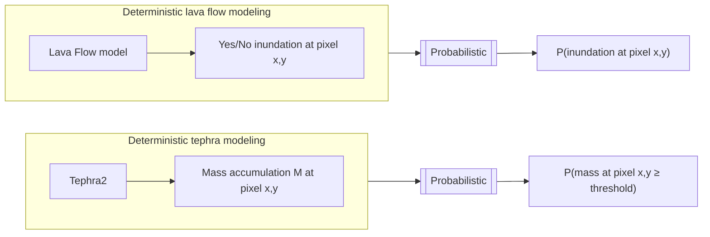

## :material-format-list-checks:{ .icn } Objectives

- Recognize the main steps of **hazard assessments** (HA).
- Understand the main HA approaches **(short vs long term)**.
- Identify main HA **outcomes**.
- Understand hazard maps
  
# :fontawesome-solid-gears:{ .icn } Definitions

## Hazard assessments

A hazard assessment is defined as an evaluation of the probability of **occurrence** of a given volcanic event of a specific **size**, associated with one or various **phenomena** affecting a given **location** during a specific time interval (Modified from Connor et al. (2015)[@Connor2015])

<figure markdown>

<figcaption></figcaption>
</figure>

It comes to answer the main questions of **when, where, how big and what areas** will be affected in case of a volcanic eruption. 

Volcanic eruptions are particularly complex since they can involve various phenomena with different products at different time and space scales. 

!!! question "What kind of volcanic hazards are you familiar with?"

    Do you think that all volcanic products have the same space extension (runout) and temporal occurrence? Give some examples

??? note "Proximal and distal hazards"

    In general proximal [volcanic hazards](https://blogs.agu.org/magmacumlaude/files/2011/04/gip64-copy.jpg) are associated with pyroclastic density currents, ballistic projectiles, lava domes and gases whilst distal volcanic hazards are associated with tephra fallout and acid rain. Secondary hazards such as lahars and aeolian remobilisation can occur any place where volcanic deposits and certain meterological conditions met. 
    
    Some of these hazards can occurr **synchronously**, prior to the eruption (e.g., gases, earthquakes), during the eruption (e.g., pyroclastic density currents, tephra fallout) or after the eruption -even decades- (e.g., remobilisation).

    :point_up: This is why volcanic eruptions are among the most complex natural phenomena to predict! 
    
     

### Occurrence: temporal scales [When?]

Forecast when an eruption can occur is based on the **recurrence rate** or the number of expected events within a given time interval within a specific range of eruption size. 

It is based on the assumption that future activity rates can be extrapolated from the **past rates**, that is to assume a **steady state behaviour**. 

=== "Data requirements"

    <figure markdown>
    
    <figcaption> Cumulative number of eruptions over time since the formation of Cerro Negro volcano in 1850. 
    
    
    Slope corresponds to the **mean eruption rate**. 

    
    Slope breaking points could indicate changes on eruptive behaviour (red arrows). Activity of Cerro Negro is clearly NOT in steady-state, with a significant increasing of frequency since 1947.</figcaption> 

=== "Uncertainties"

    !!! warning "There are many *unknowns* when studying past eruptions"
         - **Record completeness:**
            depending on the volcano, it is difficult to constrain how many and how big were past eruptions. For example, in the Japan record ~97% of VEI < 4 eruptions older than 200 ka are missing!
         - **Deposit footprint:**
            variability of eruptive styles during the same eruption implies complex stratigraphic features that are not always distinguishable from deposits, especially with pulsatory and long-lasting eruptions.     
         - **Quiescence vs extinction:**
            We don't know the story of many volcanoes on Earth. For example, prior to the 2008 eruption of Chaitén volcano (Chile), this volcanic system was considered to be long dormant, perhaps not having erupted during the last 9 ka. Following the 2008 eruption, there was renewed interest in stratigraphic studies of this volcano, which revealed more frequent Holocene activity than previously known (Connor et al. 2015)[@Connor2015]. Some of these uncertainties are irreducible. But in all cases, a **clear documentation of the dataset and discussion of its completeness** is required in any volcanic hazard assessment.  
         - **Statistical models:** 
            :point_up: Considering all these caveats, sophisticated models are required in order to disentangle past stories of volcanoes!

### Location: spatial scales [Where?]

Forecast precisely the location of next vent (main eruptive source) is not trivial at all! It is based on the assumption that **new vent forms and integrates** to one across the region of past events, that is to assume a **steady state behaviour**. 

Polygenetic volcanoes are typically large structures whose vents are active for **several events**. Monogenetic volcanoes, in contrast, are defined as small volcanic edifices where activity limits to **one episode** lasting from few weeks to months, or even to few years or decades. 

=== "Data requirements"

    <figure markdown>
    
    <figcaption> Probabilities of one or more volcanic vents in the next 100 ka are computed based **only** on the location of previous events. The Tohoku volcanic arc is constituted approximately of 170 Holocene volcanoes!!. 

=== "Uncertainties"

    !!! warning "There are many *unknowns* when studying past eruptions"
          - **Record completeness:**
            A good knowledge of past events and deposits is **crucial to infer the source and consequently the direction** of phenomena and products (e.g., lava flows, pyroclastic flows) and, thus, the potential impacted areas. 

        
            This is particularly important on steep-sided composite volcanoes, where a small change in vent location can lead to forecast flows descending into a completely different flank of the volcano. 

        
            Since monogenetic volcanism implies that past activity occurred only once in each location, the prediction of future vents presents a major challenge!!  

  
      
         - **Statistical models:** 
            Spatial models based on [Kernel](https://en.wikipedia.org/wiki/Kernel_density_estimation) estimates involve sophisticated mathematical models whose parameters, in particular the bandwidth (or smoothing parameter), strongly affect the output if is arbitrarily selected. 

        
            Ancillary data such as the distribution of volcanic earthquakes could help informing the location of past vents. 

            In addition, note that this statistical structure uncouples the temporal forecasting problem from the spatial forecasting problem. Estimates of the recurrence rate are not mathematically linked to estimates of the spatial density which is inappropriate on some volcanoes where there is migration of activity.
        
            :point_up: An area of significant future research is the formulation of spatiotemporal models making this link!!

### Extension and size: magnitude, intensity scales [How big? What areas affected?]

Forecast the potential **phenomena**, their mechanisms of **propagation** and **products** from volcanic eruptions are intrinsically related with their **size**. 

Size of eruptions are measured in terms of **Magnitude**, that corresponds to the mass of material erupted (kg); and **Intensity** that corresponds to the Mass Eruption Rate [MER] (kg/s). 

An indirect measure of size, based on the total volume of tephra emmitted during an eruption is the [Volcanic Explosivity Index](https://en.wikipedia.org/wiki/Volcanic_explosivity_index) [VEI]. It is important to note that a VEI of 0 corresponds to effusive eruptions but this does not *really* account for the real volume of effusive material (e.g., lava flows) that can be significant in large effusive or hybrid (i.e., effusive + explosive) eruptions. 

Size of eruptions will indirectly inform about the potential phenomena (and products) expected, which ultimately determine the extension of potential affected areas.

 The Global Dataset of the Smithsonian Institution [GVP] is an useful inventory of recorded eruptions including geological and historic datasets, classified per VEI (when available).

=== "Geological studies"

    <figure markdown>
    
    <figcaption> Detailed stratigraphy of volcanic deposits help identifying past eruptive styles and the associated phenomena (e.g., tephra, lava flows), as well as estimating erupted volumes (and consequently VEI). 
    
    However, the variability during the event are often too complex to be recorded by the different layers of deposits, particularly for long-lasting and pulsatory eruptions. 

=== "Historical record"

    <figure markdown>
    
    <figcaption> A fundamental source of information is the **historical** data that help constraining the story of each volcano.

    The cumulative number of events over time of  Cotopaxi volcano (Ecuador) shows 78 recorded eruptions classified per size. A clear change of **recurrence rate** at ~3.9 ka BP is associated with a shift of composition from rhyolitic to andesitic, decreasing the volumes erupted. 

=== "Uncertainties"

    !!! warning "There are many *unknowns* when studying past eruptions"

        First HA were based only in the detailed **field reconstruction** of deposits and **historical descriptions** of eruptions. However, this approach totally relies in the deposit characterization, meaning that could be significantly biased towards the largest events (or the well preserved deposits). The footprint of smaller eruptions is generally eroded and many times small pulsatory but long-lasting eruptions pose major problems to the communities in the long-term. In addition, old deposits are the footprint of a particular atmospheric and surface conditions that will not be necessarily the same in the future. For all these reasons, significant advances have been achieved in **computational modelling** that encompass the physical processes with the past evidences behind each phenomena. 

        In the same way that meteorological models, volcanological models can be used to forecast future eruptions with a large variability of conditions. 
  

# :fontawesome-solid-gears:{ .icn } Computational modelling

At present there is a large diversity of computational models from **empirical** to **analytical** and **numerical** models for each volcanic phenomena. Some are more developed than others, particularly those associated with wide-spread and more frequent phenomena, such as tephra fallout. 

This table summarize the most common ones but a complete reference list with software and references is available [here](http://193.206.223.51:8088/index.php/softwarelist). 

<figure markdown>

<figcaption></figcaption>
</figure>

# :fontawesome-solid-gears:{ .icn } Approaches

According to the level of knowledge of a given volcano and the needs/priorities of risk reduction, there are 2 main approaches to evaluate volcanic hazards: **short-term** and **long-term** hazard assessments. The main difference is the selected timing to evaluate potential hazards that will have strong implications on the purpose of each assessment. 

<figure markdown>

<figcaption></figcaption>
</figure>

Once the volcano starts showing signs of unrest (e.g., increasing seismicity, gases or deformation), short-term HA are conducted in order to understand possible scenarios and rapidly build emergency strategies. These HA need to be continuously updated (daily/weekly). Long-term HA are generally comprehensive analysis based on the *best* knowledge of the volcano, and should be ideally updated integrating the new information generated during the recent event, to calibrate the models with new eruptive parameters. Long-term HA can be deterministic and probabilistic. 

=== "Deterministic"
    Deterministic HA represent the most likely combination between the occurrence of a phenomenon and the potential extent, generally based on a past **known scenario**. Hazard parameters are therefore **fixed** to given values.

    <figure markdown>
    
    <figcaption> Updated [lava flow hazard map](https://www.usgs.gov/news/volcano-watch-lava-flow-hazard-map-revisited) of Hawaii from Wright et al. (1982) [@Wright1992]. 

    !!! important "These HA are generally rapid and very useful to inform decision makers about potential impacts of specific scenarios! However, they ignore the uncertainty of natural processes that is reflected in a large variability of parameters." 
    
   
=== "Probabilistic"
    Since deterministic HA cannot encompass all the **variability** of eruptions, probabilistic methods have been developed to make vary both eruptive parameters and atmospheric conditions. These HA rely on **numerical modelling** and require a good knowledge of input parameters. 

    Note that a fully probabilistic HA must include the probability of occurrence of an eruption of given size and location, otherwise, the probabilities expressed in those assessments are *conditional*, assuming that the eruption *will* occur. 
         
    <figure markdown>
    
    <figcaption> Example of probabilistic tephra HA for Tarawera (New Zealand), from Bonadonna et al. 2005 [@Bonadonna2005].

    !!! important "Despite requiring significant time and computational resources, these HA are comprehensive and include several potential scenarios. They are, however, difficult to interpret and to communicate to decision makers!"

# :fontawesome-solid-gears:{ .icn } General methodology

ADD figure!

# :fontawesome-solid-gears:{ .icn } Outputs

There are 3 main outputs of hazard assessments:

=== "Reports"

    All HA should include a complete documentation including:
    
   :white_check_mark: **Full description of scenarios** considered in the analysis with eruptive parameters, atmospheric and surface conditions. 

   :white_check_mark: Complete description of the **methodology** applied with mathematical models and assumptions considered. 

   :white_check_mark: **Glossary** and **properties** of outputs (e.g., map legend, hazard metrics, scales, coordinate systems). 

   :white_check_mark: Clear **quantification of uncertainties** and their meaning. 

=== "Hazard maps"
    A hazard maps is a spatial representation of the footprint of a given volcanic phenomenon that have been assessed either deterministically or probabilistically. 

    They are built over an area at local, regional or global scale. 

    For more on hazard maps go to [understanding hazard maps](hazard_maps.md)We have [previously](Hazard_probabilistic1.md) 

=== "Hazard curves"

# Outputs

-------

  
## :fontawesome-solid-gears:{ .icn } Probabilistic hazard modelling 

For the sake of this exercise, let's consider a [Plinian](https://en.wikipedia.org/wiki/Plinian_eruption) eruption from [Cotopaxi](https://en.wikipedia.org/wiki/Cotopaxi) volcano (Ecuador) that occurred ~1200 years ago. By using the [workflow](Hazard_tephra_intro.md#field-mapping-toolbox) previously introduced, we were able to reconstruct the ESP of the eruption[^1]. 

=== "Deposit Maps"

    <figure markdown>
    
    <figcaption>Figure 1: *Isopach* (**a**, contours of equal thickness) and *isopleth* (**b**, contours of equal largest clasts) for the selected deposit of Cotopaxi volcano. Both maps are in $cm$. </figcaption>
    </figure>

=== "Eruption classification"

    <figure markdown>
    
    <figcaption>Figure 2: Eruption classification using deposit properties using the methods of **a** Bonadonna and Costa (2013) and **b** Pyle (1989).</figcaption>
    </figure>

Based on this, we were able to estimate that **4.5**$\times 10^8\ m^3$ of tephra were erupted from a **25** km-high plume over ~1h, and that the deposit indeed shows the characteristics of a Plinian eruption[^2][^3]. Based on the volume, this eruption had a VEI of 4.

Great. We now have one reference eruption. But is that sufficient to be used as a **representative hazard information** for a future eruption of Cotopaxi volcano?

### The early days: deposit-based hazard maps

For a long time, reference eruptions have been used as representative of the most likely future behaviour, in which case an isopach map such as Figure 1 was used as the hazard map for tephra accumulation. 

!!! question "What do you think is missing??"

    Do you think that this approach represents a comprehensive representation of the possible hazard from future eruptions? Why, or why not? What do you think is missing?

    Spend some time thinking about these aspects in an intuitive way.

??? warning "Missing component #1"

    The [Global Volcanism Program](https://volcano.si.edu) of the Smithsonian Institution is a useful database that attempts to compile the eruptive histories of volcanoes that have been active during the [Holocene](https://en.wikipedia.org/wiki/Holocene). Let's have a look at the eruptive history of Cotopaxi volcano inferred this database:

    { width="500" }

    **What do we see?**

    - 78 eruptions are recorded in the catalogue.
    - VEI vary between 1 and 5, which mean that during its history, eruptions at Cotopaxi volcano have had:
        - Plume heights varying between 10's of meters to 10's of km.
        - Erupted volumes varying between 10$^{-5}$ to 10$^{1}$ km$^{3}$.

    !!! danger "Lesson #1"

        Using **a single isopach map** implies that we are considering **one realisation** of the scope of eruptive behaviour that a given volcanic system is capable of exhibiting.

??? warning "Missing component #2"

    The tephra fallout hazard extends in the direction of the dominant wind patterns, which [vary in time and space](https://earth.nullschool.net). Let's look at statistics of wind velocity and direction over the past 15 years at a given volcano:

    { width="500" }

    **What do we see?**

    - Between the **dry** and the **rainy** seasons, the wind direction at this specific volcano can **shift by 180 degrees**.
    - The **rainy** season is characterised by lower wind velocities.

    !!! danger "Lesson #2"

        Using **a single isopach map** implies that we are considering **one realisation** of the possible atmospheric patterns in which a future eruption could occur.

As a summary, the [previous lesson](Hazard_tephra_modeling.md) has provided us with a methodology to **predict tephra accumulation**, but we need to be able to account for **the inherent variability** of ESP when quantifying the associated hazard.

### Probabilistic eruption scenarios

Probabilistic hazard modelling for tephra fallout follows the same general philosophy compared to what we adopted for [lava flows](Hazard_probabilistic1.md) with two notable differences.

1. **Model input &rarr;** For [lava flows](Hazard_probabilistic1.md), we used a *non-physical model*. As a consequence, we explored the uncertainty associated with vent location and the DEM rather than physical properties - or, in other words, ESP. Input parameters to `Tephra2` are, however, physical ESP, and the aim of the probabilistic modelling approach for the tephra hazard will be to **explore a range of possible eruption conditions** for a future event. 

2. **Model output &rarr;** For [lava flows](Hazard_probabilistic1.md), the output of one single run consisted of a boolean inundation/no inundation condition, and the probabilistic approach quantified a **likelihood of pixel inundation** by a lava flow. Conversely, the output of a single `Tephra2` run is a *hazard intensity*, namely a **mass accumulation per surface area** ($kg/m^2$). The probabilistic approach will therefore help us to quantify a **likelihood of a mass at a given pixel to exceed a specific threshold of mass accumulation**. This flowchart illustrates the differences between these approaches:

#### Identify ESP ranges

The first step for the probabilistic hazard assessment of tephra fallout is to define an **eruption scenario**. An **eruption scenario** represents what we expect to be a possible future eruption behaviour based on our knowledge of the volcanic system. Concretely, an **eruption scenario** is defined by a **spectrum of possible values** that each **ESP could exhibit** during a future eruption. Probabilistic modeling requires to define ESPs not as **single** but as **distributions** of values, generally defined as:

1. A **range** of values (i.e., the `minimum` and `maximum` values to explore).
2. A **shape** of distribution. 

Let's go back to the Cotopaxi eruption presented above. The **plume height** estimated from the study of the deposit is **25 km**. Based on our *knowledge*, we might postulate that a plume height of **25 km** is indeed likely for a future eruption but want to acknowledge that our level of uncertainty may allow the plume height to vary between 20-30 km. In this case, we might adopt a `normal` distribution as shown in Figure 3.

<figure markdown>

<figcaption>Figure 3: Starting from a deterministic (i.e., reference eruption) approach (left), an eruption scenario is defined by i) identifying a range (center) and a distribution (right) for each ESP.</figcaption>
</figure>

We need to repeat this process for all ESP relevant for the model used. For `Tephra2`, we will focus here on `Plume height` and `mass/volume`. 

!!! info "The *how* and *why* of eruption scenarios"

    There is no magic answer on **how** to define eruption scenarios. This depends on a case-per-case basis and is often constrained by such aspects as the knowledge of the volcanic system and/or the purpose of the hazard analysis.

    **Definition**

    Ranges of ESP of a given eruption scenario can be tailored to reflect:

    - A VEI 
    - An eruptive style 
    - An intensity 
    - A reference eruption 

    **Purpose**

    The way an eruption scenario is defined can also reflect the *purpose* of the study. For instance, a long-term hazard study designed for *preparedness* might rely on eruption scenarios that consider wide ranges of EPS and focuses on **epistemic** uncertainties. Conversely, a hazard assessment required for *emergency management* during a crises might be informed by monitoring, and the associated scenario might be defined by narrower ranges of ESP that dominantly focus on the **aleatory** error. 

#### A note on the uncertainty of ESPs 

Choosing the most appropriate *range* and *distribution* for each ESP is **not trivial** and express the uncertainty that we have of what the next eruption will be. We have briefly discussed this at the end of [this module](Hazard_lava_modeling.md), but let's review again what **uncertainties** are and where they are originating from.

Conceptually, uncertainties can be classified in two categories:

!!! example "Uncertainties"

      - **Epistemic uncertainty**  derives from the lack of knowledge regarding a phenomena. In theory, we could reduce epistemic uncertainties if more observations of the phenomena were available to help us better constrain the underlying processes and behaviours.
      - **Aleatoric uncertainty** is associated with the inherent randomness of natural processes. Nothing much we can do about it, really!

Figure 4 illustrates four different **distributions** that have been used in the literature to express ESP variability. These distributions combine both **epistemic** and **aleatoric** uncertainties. Although a better characterisation of the **epistemic** uncertainty would help to refine the *top left* distribution towards a distribution centered on a *best guess* values, the constant presence of an **aleatoric** component of uncertainty is the reason why the *bottom right* distribution is impossible to achieve.

!!! warning "Probability distributions for ESP"

    <figure markdown>
    {width="450px"}
    <figcaption>Figure 4: Illustration of various probability distributions used for EPS sampling</figcaption>
    </figure>

    - The **top left** example is a `uniform` distribution: In this case, any value between `min` and `max` has an **equal probability of occurrence**. This is often referred to as a *maximum level of ignorance*. 
    - The **top right** example is a `normal` distribution: Here we assume that **a central value** has the highest probability of occurrence, but it can divert from it in a **symmetrical** fashion.
    - The **bottom left** example is a `logarithmic` distribution: In this case, we assume that **smaller values** have higher probabilities of occurrence **than larger** ones. For instance, large earthquakes occur more often than small ones. 
    - Finally, the **bottom right** example represent an unrealistic case where `min`=`max`. This would only occur if there was **no uncertainty**.

The critical objective here is to attempt to **translate our knowledge of the volcanic system** into **realistic eruption scenarios**. But **how do we improve our knowledge** and therefore **reduce epistemic uncertainties** around ESPs? 

Pragmatically, there are three main directions to do so:

1. **Field studies &rarr;** Ideally, identifying the range of ESPs is based on **extensive field studies**. By reconstructing the **stratigraphy** of a volcanic edifice, we can study its **past eruptive history**, which is then used to estimate the potential future **eruption scenarios**. 
2. **Literature review &rarr;** This *personal* knowledge is then usually complemented by **published literature**. 
3. **Analogues &rarr;** However, for volcanoes with a poor geological record, it is often necessary to extend our knowledge based on **analogue** volcanoes or eruptions. Despite the development of [dedicated methodologies](https://github.com/BritishGeologicalSurvey/pyvolcans)[^4], this largely remains a *subjective* process. This step often relies on global eruption databases such as [GVP](https://volcano.si.edu)[^5] or [LaMEVE](https://www2.bgs.ac.uk/vogripa/view/controller.cfc?method=lameve)[^6].

#### Eruption scenario for Cotopaxi volcano

Let's go back to the Cotopaxi case and develop an eruption scenario based around this reference eruption. Based on the eruption from Cotopaxi, we defined a **VEI-based** eruption scenario assuming:

1. Volume/mass constraints based on a **VEI 4** eruption &rarr; 0.1–1 $km^3$ or 0.1–1 $\times 10^{12}\ kg$.
2. Plume heights of 20–30 $km$. 
3. Wind conditions based on Reanalysis datasets.

Note that for **1** and **2**, we adopt a **normal** distribution. In this way, we consider that the values obtained from the deposit characterisation are the most likely, but that diverging values also have non-null probabilities of occurrence (albeit less likely).

!!! info "Reanalysis datasets"

    Reanalysis datasets are incredibly useful datasets providing gridded atmospheric conditions at **consistent spatial and temporal resolutions** for the past 5-7 decades. Initially developed to constrain the initial conditions for weather forecasts, we used them in probabilistic tephra modeling to estimate the most likely wind conditions at a given volcano. We typically download 10-20 years of wind, and these datasets provide one wind profile per either 1, 6, 12 or 24 hours. 

    We rely on two main Reanalysis datasets: [ERA5](https://www.ecmwf.int/en/forecasts/datasets/reanalysis-datasets/era5) from the European Centre for Medium-Range Weather Forecasts (ECMWF) and the [NCEP-DOE Reanalysis 2](https://psl.noaa.gov/data/gridded/data.ncep.reanalysis2.html).

### Probabilistic hazard modelling

Now that we have defined the eruption scenario and associated ESPs, let's actually run the probabilistic hazard modeling. Similarly to the approach used for [lava flows](Hazard_probabilistic1.md), we will perform a large number of single model runs. But instead of varying the `vent location`, each run be initiated with **one set** of ESP stochastically sampled from the pre-defined distributions.

The cartoon below illustrates the process. We modeled $n$ runs: here $n=3$, but we would typically used *thousands* of runs to ensure that ESP drawn from each distribution represents a statistically significant sample of the range of possible combinations and outcomes.

=== "Run 1"

    
    

=== "Run 2"

    
    

=== "Run n"

    
    

#### Computing hazard probabilities 

Let's compute probabilities for the following points: `P1`, `P2` and `P3`. 

- Across the 3 runs, `P1` had accumulations of 0 $kg/m^2$ for the first two simulations and 5 $kg/m^2$ for the third one.
- `P2` resulted in accumulations of 15, 12 and 2 $kg/m^2$ over runs 1,2 and 3, respectively. 
- `P3` had accumulations of 7, 5 and 0 $kg/m^2$ for runs 1,2 and 3, respectively.

Let's now consider two tephra accumulation thresholds of 1 and 10 $kg/m^2$. We want to express **how likely** these accumulations are to occur over our set of runs. Let's take two examples:

- Across the 3 runs, an accumulation of 1 $kg/m^2$ at `P1` occurred in 1/3 cases: a future tephra accumulations at `P1` therefore has a 33% probability to exceed a threshold of of 1 $kg/m^2$.
- At `P2`, an accumulation of 10 $kg/m^2$ occurred in 2/3 cases: a tephra accumulation of 10 $kg/m^2$ therefore has a 66% probability of occurrence.

By repeating this approach over all points of the map, it is now possible to represent **the spatial distribution** of hazard. 

!!! note "What probabilities?"

    Again, pay attention to [what these probabilities express](Hazard_probabilistic2.md#probabilistic-eruption-scenarios):

    - In the case of [lava flows](Hazard_probabilistic1.md), one single model run estimates a **boolean** yes/no inundation for each pixel, and the probabilistic approach quantifies a **probability of flow inundation** (&rarr; one single map). 
    - In the case of tephra deposits, one single model run estimates a **continuous** hazard intensity (i.e., mass of tephra per unit area). The probabilistic approach quantifies a **probability of accumulation to exceed** specific masses per unit area. Therefore, the output for probabilistic hazard assessment for tephra accumulation consists of **multiple maps** (&rarr; one map per accumulation threshold). 

!!! info "Formalising probability computation"

    We have defined an eruption scenario $E$, and we now want to compute the probability $P$ of a given geographic point $x,y$ to be subject to mass accumulations $M$ exceeding a given accumulation threshold $M_T$:

    $$ P[M(x,y) \geqslant M_T \mid E] $$

    This probability $P$ is computed using a simple *frequentist* approach: We simply divide the number of simulations that resulted in an accumulation exceeding the considered threshold (&rarr; $M(x,y) \geqslant M_T$) by the total number of runs:

    $$ P(x,y) = \frac{\sum_{i=1}^{N_{r}}n_{i}}{N_{r}} $$

    Where $N_{r}$ is the total number of runs and $n_{i}$ is defined as:

    $$ n_{i} = \bigg\{ ^{1, if M(x,y) \geqslant threshold \mid run} _{0, otherwise} $$

!!! warning "*Conditional* probabilities"

    The equations above highlight that the probability $P$ is **conditional to the occurrence of the eruption scenario**. For now, we are only considering this question:

    > What is the probability of a given geographic point to suffer tephra accumulations exceeding $x\ kg/m^2$ **given that the eruption scenario E is occurring**. 

    Bear that in mind. We'll get back to this later.

#### Hazard outputs

We now have a framework to quantify **hazard occurrence** probabilistically, but how do we turn this *information* into a useful *knowledge*? Let's look at the different methods available to *display* probabilistic hazard analyses.

For tephra fallout, we have **4 quantities** to represent that are:

- `Latitude` and `longitude`. 
- `Tephra accumulation`. 
- `Probability of occurrence`.

However, it is difficult to represent more than **3 quantities** on such a 2D canvas as a map, and we therefore need to **fix one quantity**, which provides us with 3 different approaches to express hazard. 

!!! example "Method 1: Probabilistic hazard maps"

    &rarr; Fixed threshold of **tephra accumulation**.

    &rarr; Other quantities are expressed continuously. 

    &rarr; Display the spatial distribution of exceedence probabilities **of a single threshold of tephra accumulation** (i.e., there are as many maps as accumulation thresholds). 

!!! example "Method 2: Probabilistic isomass maps"

    &rarr; Fixed threshold of **exceedence probability**.

    &rarr; Other quantities are expressed continuously. 

    &rarr; Display the spatial distribution of tephra accumulation **for a single exceedence probability value** (i.e., there are as many maps as probability values). 

!!! example "Method 3: Hazard curves"

    &rarr; Fixed latitude and longitude.

    &rarr; Other quantities are expressed continuously. 

    &rarr; Display the probability of occurrence of a given tephra accumulation **for a single location** (i.e., there are as many curves as points of interest). 

Is the difference between **probability** and **isomass** maps are? Lets look at these sketches:

=== "Graphically..."

    

    - On the left, **probabilistic hazard maps** quantify the probability to exceed a mass accumulation. Contours show **equal probabilities**.
    - On the right, **probabilistic isomass maps** show the mass accumulation occurring for a given probability. Contours show **equal accumulations**. 

    Therefore, both maps show the same information but emphasise different quantities.

=== "More formally..."

    

    Probabilistic hazard modelling estimates the tephra accumulations at a given pixel $x,y$ for all of the $n$ runs (here, $n=5$). 

    - To produce **probabilistic hazard maps**, we adopt the frequentist approach previously described and calculate the probability to exceed a given mass accumulation &rarr; e.g., this pixel has a 3/5 = 60% probability of exceeding a tephra accumulation of 10 $kg/m^2$.
    - To produce **probabilistic isomass maps**, we estimate the **inverse** of an **empirical cumulative density function** (i.e., the survivor function) using all modelled accumulations &rarr; e.g., the accumulation associated with a 25% exceedence probability is 36 $kg/m^2$.

!!! info "Rule of thumb"

    Bear in mind: **large** tephra accumulations usually have **lower** probabilities of occurrence than **smaller** accumulations.

## :material-thought-bubble:{ .icn } Hazard output example

Let's change volcanoes and continents: The examples below illustrate a hazard assessment for a VEI 4 Plinian eruption at [Sakurajima](https://en.wikipedia.org/wiki/Sakurajima) volcano[^7] in Japan, developed around the 1914 Taisho eruption[^8]. Note that the hazard modeling procedure was exactly the same as for Cotopaxi.

=== "Probability maps"

    These maps show the spatial probability to exceed accumulations of 1 (left) and 100 (right) $kg/m^2$. The top and bottom maps illustrate the impact of wind variability on the computed dispersal as a function of the season. The general dispersal is towards the E, but the summer shows a higher variability in directions and lower wind velocities, increasing the hazard on the city of Kagoshima (point number 3).

    

=== "Isomass maps"

    These maps show the typical tephra accumulations for probabilities of occurrences of 25% (left) and 75% (right). Compared to probability maps, we can use the famous saying used in SE Asia: *Same same, but different*.

    

=== "Hazard curves"

    This plot shows hazard curves computed for three different locations (see the maps for reference):

    1. Tarumizu City Hall
    2. Kagoshima airport
    3. Tarumizu central station

    Curves show a continuous relationship between tephra accumulation and their respective probabilities of occurrences. The advantage of hazard curves is that they can represent **more than a single eruption scenario**, which helps comparison. For instance, these plots contain the modelling of the VEI 4 eruption scenario using wind profiles for i) all seasons combined (solid line), the summer (dashed line) and spring, fall and winter (dotted line). 

    To read these plots, start by identifying one tephra accumulation for which you want to estimate the associated probability of occurrence. From the plot's x axis, go straight up until the intersection with the curve representing the scenario of interest. From the point of intersection, go straight left and read the probability value on the y axis.

    For instance, the Tarumizu City Hall has a ~8% probability of exceeding accumulations of 100 $kg/m^2$ following a VEI 4 eruption of Sakurajima volcano.

    

<!-- ## Various approaches for hazard assessment

### Deterministic scenarios

**Deterministic** hazard assessments: Usually based on past events, they express the hazard should *the exact same event* happen again in the future. As we have seen, this is impossible, and, in the end, this approach fails to account for and quantify uncertainties. However, their benefit is that they are easy to communicate with decision makers. Deterministic scenarios are mostly used for the development of contingency plans in contexts, **only when** a well-established communication channel exists between monitoring agencies, decision-makers and stakeholders. 

### Scenario-based 

### Probabilistic volcanic hazard assessments

Probabilistic volcanic hazard assessments - or **PVHA** -->

## :material-check-bold:{ .icn } Summary

That was a long module, where we reviewed: 

- [x] How ESP obtained from tephra deposits help framing future **eruption scenarios**.
- [x] How to develop **distributions of ESP** to define **probabilistic eruption scenarios**. 
- [x] How to complement ESP with global database and analogues and how to reflect **uncertainties**.
- [x] How to **run** probabilistic hazard modeling and **compute probabilities**. 
- [x] How to **display** hazard outputs.

In the next module, you will produce a **scenario-based probabilistic hazard assessment for tephra accumulation** for a future eruption at La Palma using `TephraProb`.

## :fontawesome-solid-book:{ .icn } References

[^1]: Biass, S., Bonadonna, C., 2011. A quantitative uncertainty assessment of eruptive parameters derived from tephra deposits: the example of two large eruptions of Cotopaxi volcano, Ecuador. Bulletin of Volcanology 73, 73–90.
[^2]: Bonadonna, C., Costa, A., 2013. Plume height, volume, and classification of explosive volcanic eruptions based on the Weibull function. Bulletin of Volcanology 75, 1–19.
[^3]: Pyle D., 1989. The thickness, volume and grainsize of tephra fall deposits. Bulletin of Volcanology 51, 1–15.
[^4]: Tierz, P., 2019. VOLCANS: an objective, structured and reproducible method for identifying sets of analogue volcanoes. Bull Volcanol 22.
[^5]: Simkin, T., Siebert, L., Simkin, T., Kimberly, P., 2010. Volcanoes of the World. University of California Press, Tucson, AZ.
[^6]: Crosweller, H.S., Arora, B., Brown, S.K., Cottrell, E., Deligne, N.I., Guerrero, N.O., 2012. Global database on large magnitude explosive volcanic eruptions (LaMEVE). Journal of Applied Volcanology 1, 1–13.
[^7]: Biass, S., Todde, A., Cioni, R., Pistolesi, M., Geshi, N., Bonadonna, C., 2017. Potential impacts of tephra fallout from a large-scale explosive eruption at Sakurajima volcano, Japan. Bulletin of Volcanology 79, 1–24.
[^8]: Todde, A., Cioni, R., Pistolesi, M., Geshi, N., Bonadonna, C., 2017. The 1914 Taisho eruption of Sakurajima volcano: stratigraphy and dynamics of the largest explosive event in Japan during the twentieth century. Bull Volcanol 79, 72.
[^9]: Connor C, Bebbington MS, Marzocchi W (2015) Probabilistic Volcanic Hazard Assessment. In: The Encyclopedia of Volcanoes, Second. Elsevier Inc., pp 897–910

*[HA]: Hazard assessments
*[VEI]: Volcanic Explosivity Index
*[ESP]: Eruption source parameter &rarr; most important initial conditions to a model
*[TGSD]: Total grain-size distribution
*[MER]: Mass eruption rate
*[VEI]: Volcanic explosivity index
*[HIM]: Hazard impact metrics
*[GAR]: Global assessment report
*[DDS]: Damage-Disruption states &rarr; one way of characterising vulnerability
*[GVP]: Global volcanism program 
*[GSD]: Grain size distribution

