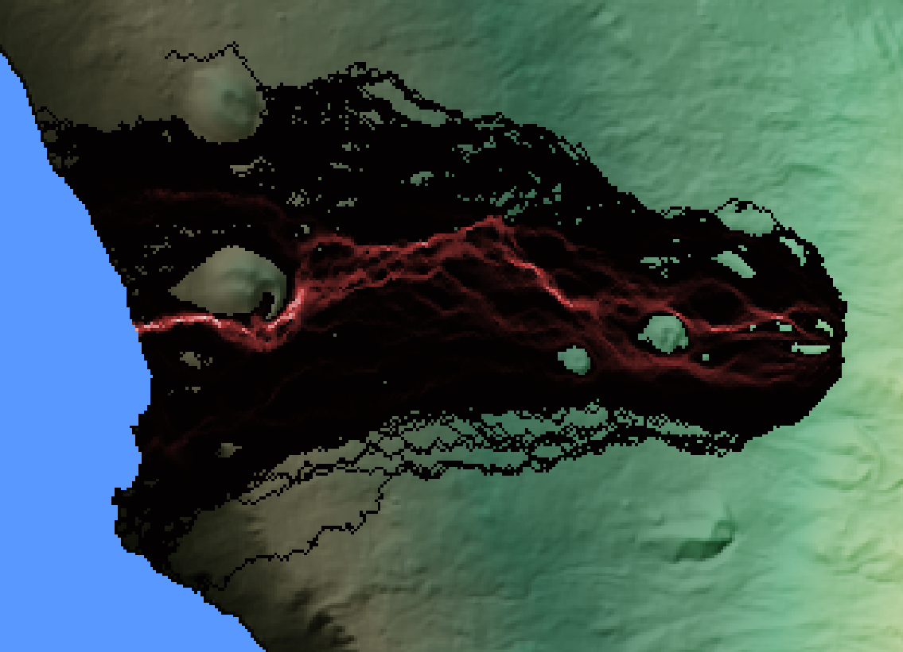

# Q-LavHA

With the knowledge gained on [topographic controls](Hazard_lava_steepest-descent.md) and [modeling](Hazard_lava_modeling.md) from the previous exercise, we will now apply the `Q-LavHA`[^1] model to estimate the hazard associated with lava flow inundation. This part of the exercise assumes that:

- You have understood the philosophy behind `Q-LavHA` according to [this guide](Hazard_lava_Q-LavHA_intro.md).
- You have already installed [`QGIS`](../Setup/qgis.md#step-1-download-and-install-qgis) and [`Q-LavHA`](../Setup/qgis.md#step-2-install-qlavha).
- You have [loaded the provided `QGIS` project](../Setup/qgis.md#step-3-load-the-qgis-project)

Alternatively, the [Q-LavHA user manual](../../../files/Usersguide_Q-LavHA_V3_2020.pdf) contains some important information about how to configure the model and the data, so we encourage you to have a look at it at some point.

## :material-format-list-checks:{ .icn } Objectives 

- Perform probabilistic lava flow modeling for several vents in La Palma using `Q-LavHA`.
- Account for the uncertainty in vent locations in hazard assessments.
  
## :material-head-flash:{ .icn } Exercise

### Running Q-LavHA for single vents

In `QGIS`, start by activating the `Vents for Exercise` layer group. These vents correspond to those indicated in the Table below. `Q-LavHA` requires [projected UTM coordinates](https://en.wikipedia.org/wiki/Universal_Transverse_Mercator_coordinate_system), which are shown in the `Easting` and `Northing` columns (`x` and `y` columns, respectively). The UTM zone for La Palma is `28N`, or [EPSG:3268](https://epsg.io/32628).

| Vent   | Latitude  | Longitude | Easting (m) | Northing (m) | EPSG  |
|:-------|:----------|:----------|:------------|:-------------|:------|
| Vent 1 | -17.83989 | 28.62507  | 222340      | 3169746      | 32628 |
| Vent 2 | -17.86626 | 28.61262  | 219728      | 3168426      | 32628 |
| Vent 3 | -17.84316 | 28.58782  | 221922      | 3165623      | 32628 |
| Vent 4 | -17.81585 | 28.60777  | 224646      | 3167772      | 32628 |
| Vent 5 | -17.84649 | 28.49699  | 221357      | 3155562      | 32628 |

Each of you has been assigned a vent. **Please run the exercise only for the vent assigned to you!**

??? warning "Coordinate systems" 

    Here, you are provided with input data that **all have the same coordinate system**. Before modeling lava flows for your own projects, make sure that you first [reproject](https://docs.qgis.org/3.22/en/docs/training_manual/processing/crs.html?highlight=reproject) all your data to a **unique** [CRS](https://epsg.io). 

#### Model setup

Let's run `Q-LavHA` for the selected vent. For now, we will assume that we know *the exact* vent location. Open the `Q-LavHA` window, and let's look at the parameters:

=== "Vent location tab"

    1. In the `DEM Selection` box, select the `Data/Lava/DEM_Qlavah.tif`. In the DEM selection window, make sure you change the type of files from `.asc` to `.tif`.
    2. As a `Vent Type`, choose `Point` for now.
    3. Add the relevant `Coordinates` as specified in the table above.

=== "Lava flow parameter tab" 

    1. `Lava Flow Propagation`: This section sets up the behaviour of the lava flow, as described in the theory section. 
       
         - Leave the default values of `Hc` and `Ht`.
         - Use the `H16` option: This means that the algorithm will first search for a topographic low within the first 8 adjacent pixels, and will extend the search to the next 16 ones if not found.
         - Use `Probability to the square`

    2. `Lava Flow Length Constrain`: This section defines *when* a lava flow stops. You can switch between the various options for an illustration of the different behaviours. As discussed above, use a `Manhattan Distance` with a length of `10000 m`. 
    3. `Simulations`: Use a `Number of iterations` of 1500. This represents the number of simulated lava flows, or $N_r$ in the equations above.

=== "Output files tab" 

    1. Set an `Output path` and a `name` to the output layers. 
    2. Save the `Parameters`. 

!!! success "Q-LavHA"
    **You are now ready to run the simulation!**

??? tip "Vent geometry"

    `Q-LavHA` offers different source geometries, such as a fissure, or a vent opening susceptibility map. The choice of these options depends on the case study, and their use is described in the [Q-LavHA user manual](../../../files/Usersguide_Q-LavHA_V3_2020.pdf).

#### Styling outputs 

Upon completion of the model run, the output file is directly added to the layer panel. Let's change its visualisation:

- Open the `Layer Properties` panel by double-clicking on the output layer in the `Layers` panel.
- From the `Symbology` tab on the left:
    - Under `Color Rendering`, uncheck the `Colorize` option.
    - Under `Render type`, choose `Singleband pseudocolor`. 
    - Set the `min` and `max` values to 0 and 0.5, respectively. 
    - Change the `Color ramp` to `Magma`
- Click ok.

The output file now shows the **spatial distribution** of **inundation probability** varying between $\gt 0$ and $0.5$ (i.e., 50%). 

??? tip "Copying layer symbology"

    In `QGIS`, you can simply copy the display properties of one layer to other layers: 
    
    - In the `Layers` panel, right-click on the layer you want to copy the style *from* and select `Styles > Copy style`.
    - Now right-click on the layer you want to apply to style on and select `Styles > Paste style`.

    {width=500}

<!-- #### Analysing results  -->

<!-- Following this procedure, run `Q-LavHA` for **all the vents specified in the Table above** and apply the same symbology. Answer the following questions: -->

!!! question "Question 1: Single-vent simulations"

    1. In one sentence, describe what the color at any given pixel expresses.
    2. How do modelled flows compare to the closest <a href="../../../files/GeologicalmapofLaPalma.pdf", target="_blank">historical lava flows</a> in terms of length and width?
    3. Analyse and discuss the spatial distribution of inundation probability. How do they compare to the path of steepest descent?

    <!-- 2. Chose *one vent* for which you will produce another run with the same parameters as above. Are they **exactly** the same? If not, why? -->
    <!-- 3. Compare simulations from **vent 2** with the flow outlines of the 2021 eruption. **When** and **where** is the model doing a good job? **When** and **where** is it not? Why? -->
    <!-- 4. Analyse and discuss the spatial distribution of inundation probability. How do they compare to flow accumulation rasters and the path of steepest descent approach?
    2. Where do branching occur? -->

### Using several vents

In the case of fissure eruptions, one eruptive episode can consist of multiple satellite vents. This was certainly the case for the 2021 eruption of La Palma. In fact, as you can see from the `2021 Vents` layer in `QGIS`, [CEMS](https://emergency.copernicus.eu/mapping/list-of-components/EMSR546) identified that ~10 vents opened over a 500 x 500 m area. Here, we won't attempt predicting the **number** or the **location** of each vent. Instead, we will model lava flow inundation from **a grid of vents** within a surface area and explore how vent location affects the lava flow simulation hazard.

!!! warning "Probability of vent opening" 

    Note that with this approach, we consider an **equal probability** of vent opening within this area. We will consider this as an acceptable assumption for this exercise, but this is likely an over-simplification for real-case scenarios.

#### Define the area 

We will define a potential vent opening surface as a 500 x 500 m square centered on the reference coordinates of your attributed vent. Note that UTM coordinates are in *metre*: you can therefore simply identify the `x` and `y` coordinates these four points by addition and subtraction:

- Lower left corner 
- Lower right corner 
- Upper right corner
- Upper left corner

#### Model setup

- From `QGIS` open `Q-LavHA`. Most of the parameters should already be filled. Otherwise, you can use the `Load parameters` option and load a previous run.
- Set a `Distance between vents` of 100 m. Since we defined a 500x500 m area, `Q-LavHA` will therefore model lava flow inundation from 25 vents. 
- Enter the 4 coordinates defining your area.
- In the `Lava Flow Parameter` tab, change the `Number of Simulations` to **100**. This will help save some computation time.
- Make sure you change the output name.

!!! success "Q-LavHA"
    **You are now ready to run the simulation!**

<!-- #### Analysing results -->

Apply the same symbology to the surface area runs as you did for the point run. 

!!! question "Question 2: Vent location uncertainty"

    1. Compare the run with its single-vent counterpart. How do they differ and why?

### Prepare your hazard maps

The raw `geotiff` files produced by `Q-LavHA` are your main hazard files. If you choose to work in `QGIS` you can further export them to maps using the `Print Layout` tool (&rarr; [doc](https://docs.qgis.org/3.22/en/docs/user_manual/print_composer/overview_composer.html) & [tutorial](https://docs.qgis.org/3.22/en/docs/training_manual/map_composer/map_composer.html)).

## :material-thought-bubble:{ .icn } Food for thoughts 

### Forecasting the flows from the 2021 eruption

Compare the `Q-LavHA` run with the flow outlines from the 2021 eruption below. Note that the `Q-LavHA` run was performed using the same 500 x 500 m source area as used above.

=== "Q-LavHA runs"

    

=== "Flow outlines"

    

!!! question "Question 3: Interpreting hazard forecasts"

    1. From what you know about both the 2021 eruption and the dynamics of lava flows, compare and discuss the hazard forecast and the actual deposit. What are `Q-LavHA`'s strengths and limitations?

### Limitations 

The method presented here is *one* amongst many attempts to estimate the hazard from lava flow inundation. This model relies on *no* to *some* degrees of physics, but inherently attempts to quantify uncertainties. It is important to recognise that although this model is *useful* and has been *validated*, it still bypasses some critical aspects of lava flows including *time*, *effusion rates* or *morphology*. Again, models are useful as long as used in the range of their **limitations** and for an **appropriate purpose**. 

## :material-check-bold:{ .icn } Summary

In this exercise, you have:

- [x] Assessed the hazard of lava flow inundation using probabilistic modeling.
- [x] Included the uncertainty on vent location in hazard estimates.
- [x] Understood the limitations of model predictions when compared to past events.

## :fontawesome-solid-book:{ .icn } References

[^1]: Mossoux, S., Saey, M., Bartolini, S., Poppe, S., Canters, F., Kervyn, M., 2016. Q-LAVHA: A flexible GIS plugin to simulate lava flows. Computers & Geosciences 97, 98–109. https://doi.org/10.1016/j.cageo.2016.09.003

[^2]: Harris, A.J., Rowland, S. FLOWGO: a kinematic thermo-rheological model for lava flowing in a channel. Bull Volcanol 63, 20–44 (2001). https://doi.org/10.1007/s004450000120

