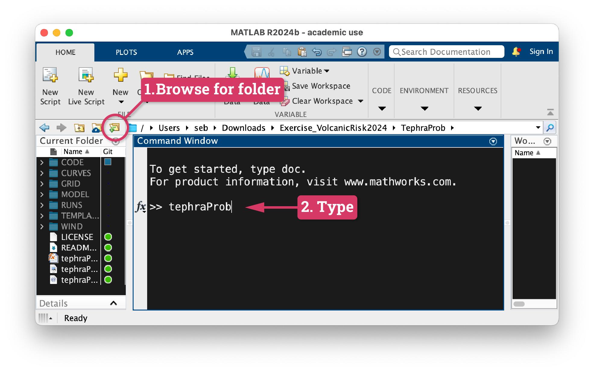
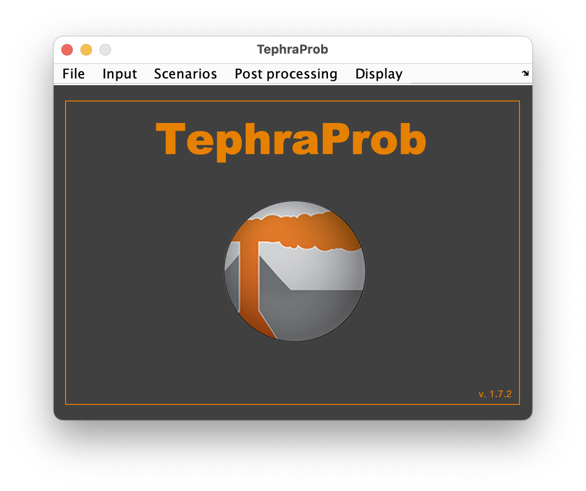

# Matlab

This tutorial takes you through the steps to download Matlab from the UNIGE servers and use your ISIS login to request a license. We will then install the TephraProb Matlab plugin [@Biass2016].

## Step 1: Request a license 

1. Go to <a href="https://logiciels.unige.ch/", target='_blank'>this page</a>
2. Login with your **ISIS** credentials
3. In the field `Recherche`, type `Matlab` and press ++enter++
4. Download the license for your OS

## Step 2: Install Matlab 

- Visit one of these pages and follow the instructions:
    - <a href="https://plone-unige-ch.translate.goog/distic/pub/logiciels/matlab/comment-installer-matlab-r2024a-sur-macos?_x_tr_sl=fr&_x_tr_tl=en&_x_tr_hl=en-US&_x_tr_pto=wapp", target="_blank">MacOS</a> → On the installation procedure, follow **Step 1a** and *not* 1b
    - <a href="https://plone-unige-ch.translate.goog/distic/pub/logiciels/matlab/comment-installer-matlab-2024a-sur-windows?_x_tr_sl=fr&_x_tr_tl=en&_x_tr_hl=en-US&_x_tr_pto=wapp", target="_blank">Windows</a> → You might need to right click on `setup.exe` and choose `Run as administrator`
    - <a href="https://plone-unige-ch.translate.goog/distic/pub/logiciels/matlab/comment-installer-matlab-2024x-sur-linux?_x_tr_sl=fr&_x_tr_tl=en&_x_tr_hl=en-US&_x_tr_pto=wapp", target="_blank">Linux</a>

!!! warning "Choose the right products"
    When arriving at the `Product` tab of the installation, **do not select all products** but make sure the following are ticked:

    - [x] **Matlab**
    - [x] **Statistics and Machine Learning Toolbox**
    - [x] **Image Processing Toolbox**
    - [x] **Parallel Computing Toolbox** → :exclamation: only if you are interested in actually applying TephraProb

## Step 3: Install TephraProb

1. Download TephraProb from <a href="../../../../files/CERG/TephraProb.zip", target="_blank"> this link</a>
2. :exclamation: **Make sure you unzip the archive you just downloaded!** On Windows, that means `right click` on the zip file and `Extract all`.
3. Open Matlab and navigate to the `TephraProb` folder you just created. For this locate the `Browse for folder` button illustrated in [Figure 1](#fig1) and open it.
4. Type `tephraProb` in Matlab's command line and press ++enter++ ([Fig. 1](#fig1)). The TephraProb window should now open ([Fig. 2](#fig2)).

<figure markdown>
  {#fig1}
  <figcaption>Figure 1: Matlab interface and location of the Browse for folder button</figcaption>
</figure>

<figure markdown>
  {#fig2, width="500"}
  <figcaption>Figure 2: TephraProb</figcaption>
</figure>
