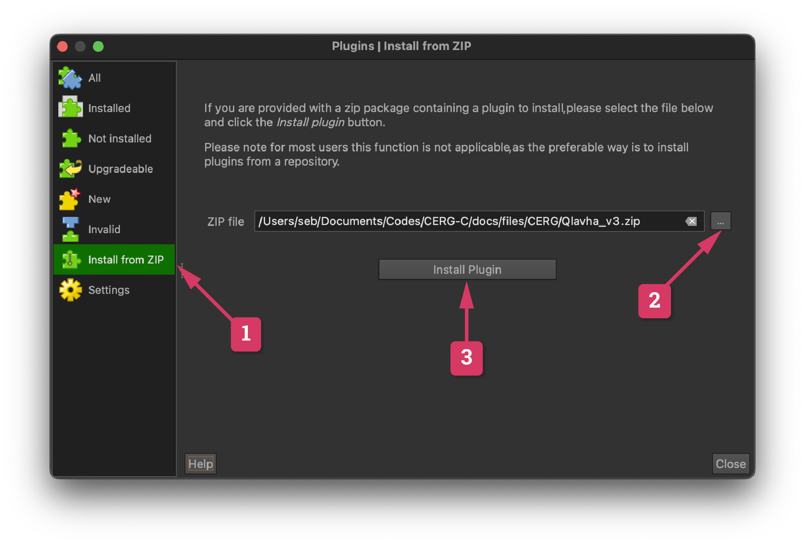
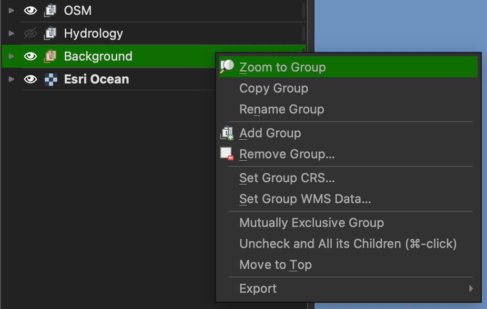

# QGIS

This tutorial takes you through the steps to install QGIS. We will then install the QLavHA plugin [@Mossoux2016].

## Step 1: Download and install QGIS 

1. Go to <a href="https://qgis.org/download/", target='_blank'>this page</a>
2. Download the **Long Term Version** for your OS
3. If needed, refer to the <a href="https://qgis.org/resources/installation-guide/", target='_blank'>installation guide</a> for more details 


## Step 2: Install QLavHA 

1. Open QGIS
2. Download QLavHA from <a href="../../../../files/CERG/Qlavha_v3.zip", target="_blank"> this link</a>
3. From the top menu bar of QGIS, choose `Plugins` > `Manage and Install Plugins`
4. From the new window ([Fig. 1](#fig1)), choose `Install from ZIP`, then locate the `Qlavha_v3.zip` you just downloaded and click `Install Plugin`
5. Going to the `Installed` tab on the left, make sure QLavHA appears and is activated

<figure markdown>
  {#fig1}
  <figcaption>Figure 1: Plugin installer window</figcaption>
</figure>

### Alternative install procedure

If the above procedure produces an error, follow these steps:

- Unzip `Qlavha_v3.zip`
- Make sure QGIS is closed
- In the *Finder* (MacOS) or *Explorer* (Windows), navigate to this location:

=== "Windows"

    ```
    C:\Users\$USER\AppData\Roaming\QGIS\QGIS3\profiles\default\python\plugins
    ```

=== "Mac OS"

    ```
    /Users/$USER/Library/Application Support/QGIS/QGIS3/profiles/default/python/plugins/
    ```

- Copy the `Qlavha_v3` folder to the `plugins` folder. If it does not exist, create it 
- Open QGIS
1. From the top menu bar, open the `Plugins` > `Manage and Install Plugins` window
2. Following [Figure 2](#fig2), search for `lava` and activate the plugin.

<figure markdown>
  {#fig2}
  <figcaption>Figure 2: Activate the Q–LavHA plugin</figcaption>
</figure>

## Step 3: Load the QGIS project

1. Download the <a href="../../../../files/CERG/Lava flow exercise.zip", target="_blank"> exercise file</a> and **unzip** it.
2. Double click on `LaPalma_basemap.qgz`. This should open QGIS as in [Figure 3](#fig3).
3. If the extent of the map canevas seems off, click any layer on the `Layer` tab on the left and click `Zoom to extent` [Figure 4](#fig4).

<figure markdown>
  {#fig3}
  <figcaption>Figure 3: QGIS project</figcaption>
</figure>

<figure markdown>
  {#fig4, width='500'}
  <figcaption>Figure 4: Re-centering the QGIS project.</figcaption>
</figure>